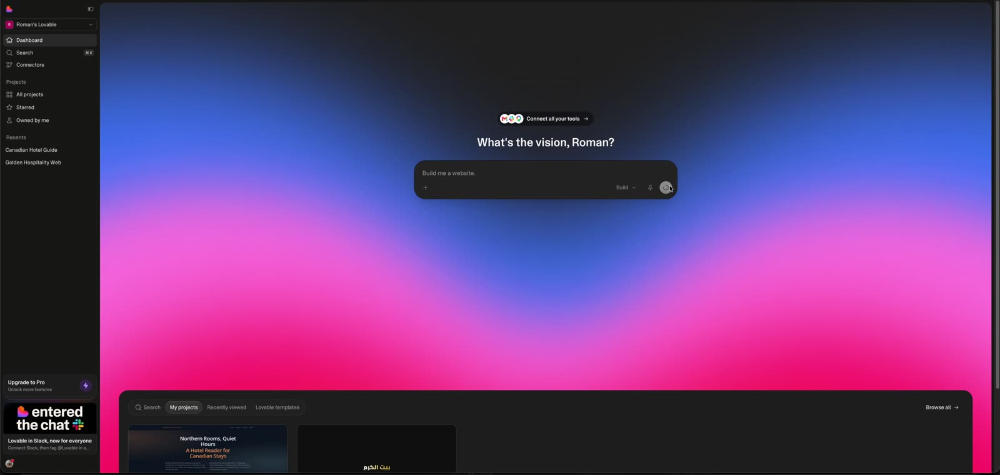
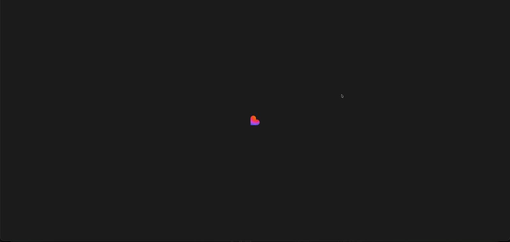
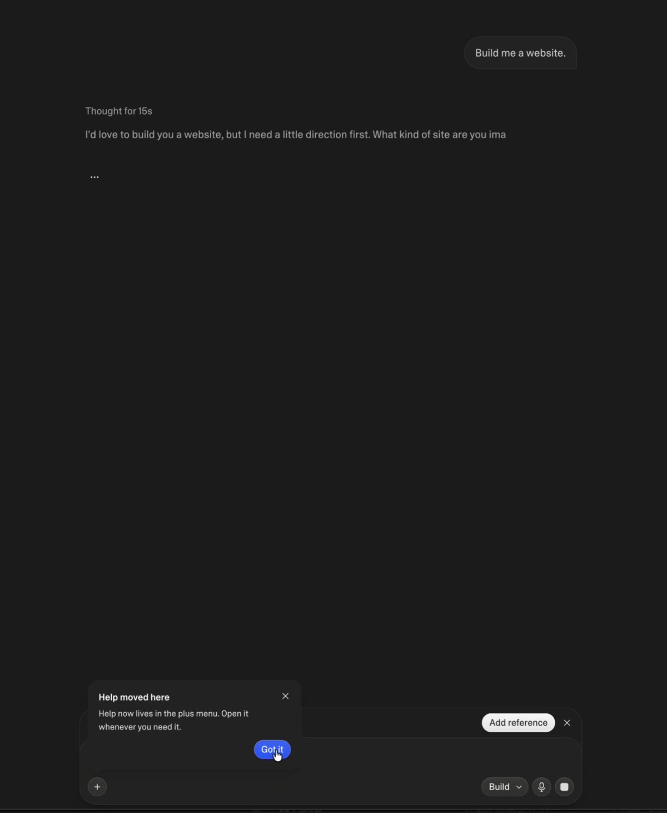
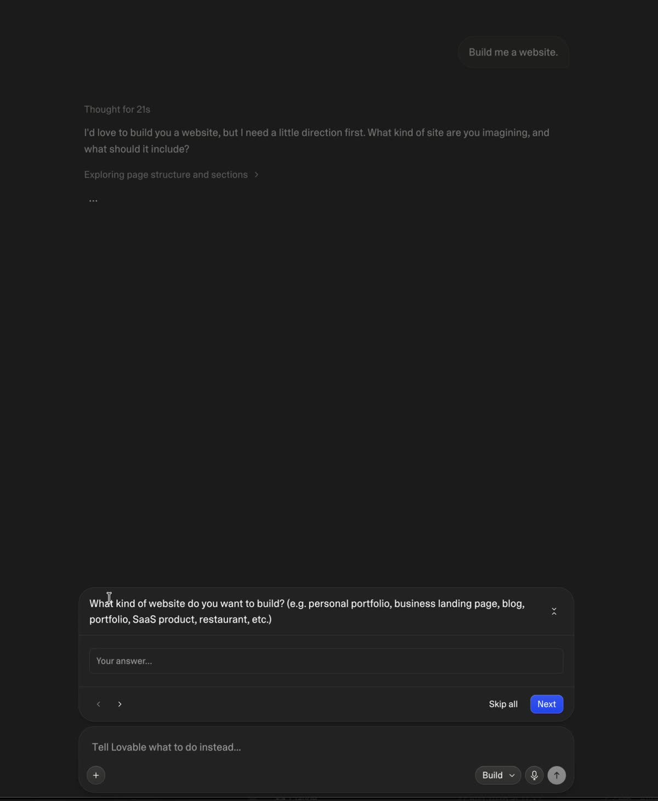
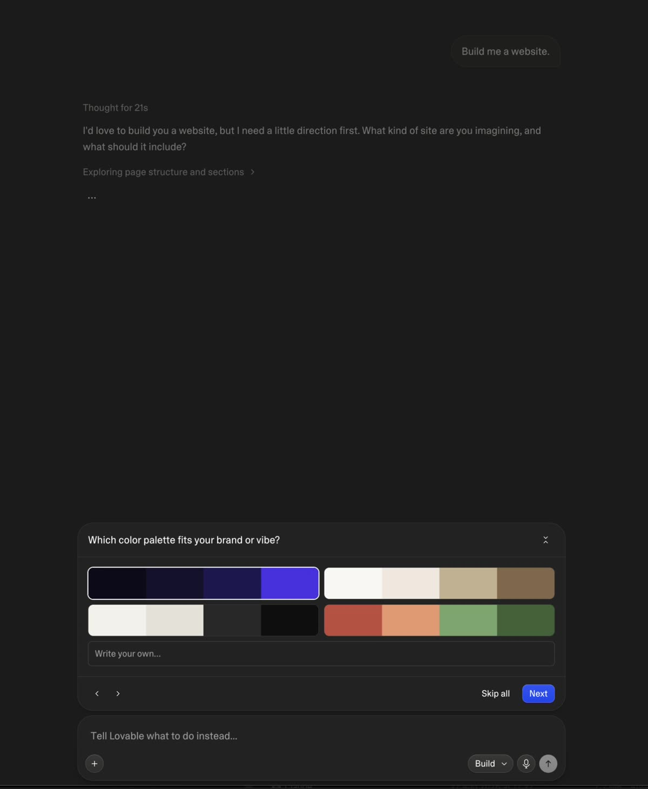
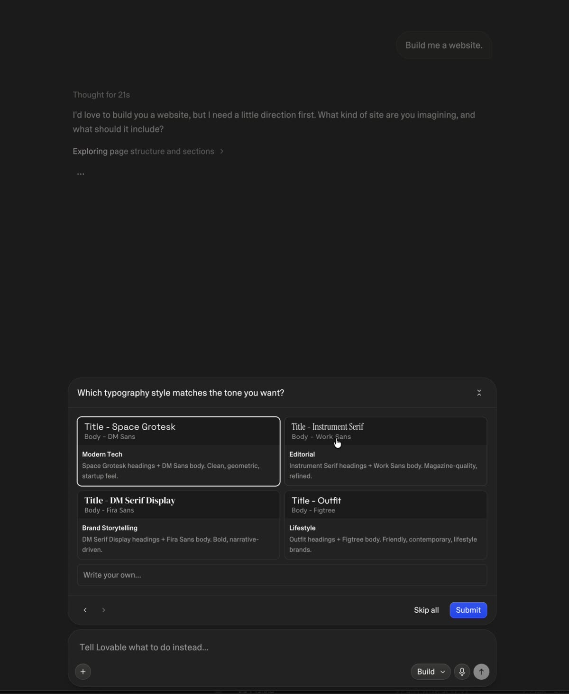
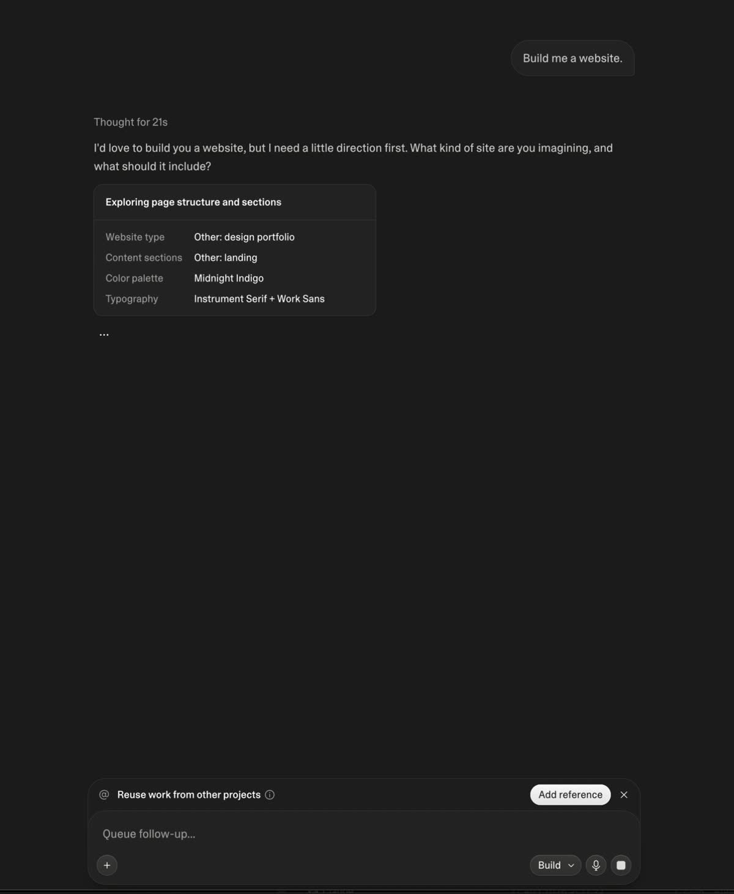
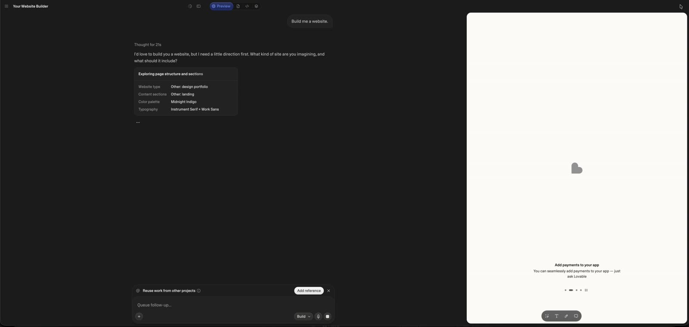
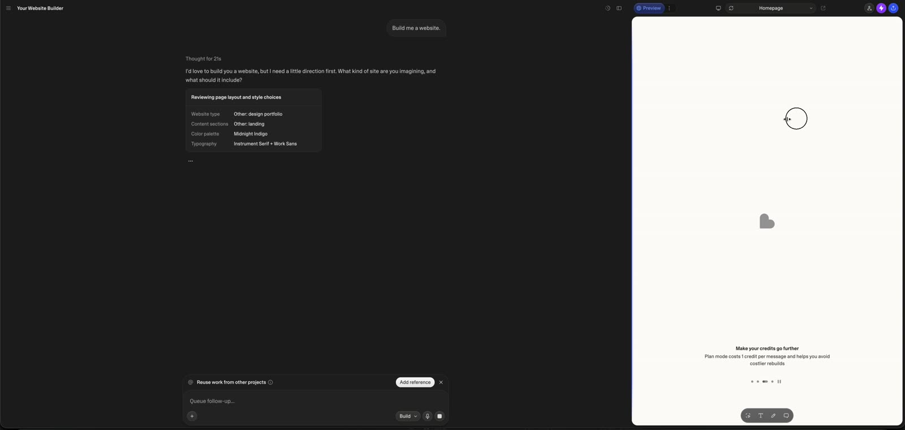

# Lovable: слабый промпт → вопросы перед генерацией → билд

**Дата съёмки: 06.09.2026.** Источник №1 — экранная запись дизайнера (Roman) в его аккаунте Lovable:
91,8 с, 4096×1946 px (Retina ×2 → 2048×973 CSS px), 60 fps. 17 опорных кадров лежат рядом:
`docs/audits/lovable-prebuild-flow/01…17`. Всё, что ниже помечено **[видео]**, снято с этой записи
и является фактом на 06.09.2026. Пометка **[docs]** — официальная документация Lovable
(добыта через поисковые сниппеты: сама docs.lovable.dev из облачной сессии недоступна),
**[likely]** — сторонние источники, **[не подтверждено]** — не нашли.

Зачем: Remixer повторяет этот флоу 1:1 — логику, вёрстку и поведение. Реализация уже в прототипе
(`prototype/src/modules/chat/brief.ts`, `BriefPanel.tsx`, `send.ts`, схлопываемое превью в `App.tsx`
и `ui/ChatResizer.tsx`), сценарий «New project — thin prompt» и флоу «Thin prompt → questions → first build»
в консоли. Раздел 7 перечисляет, где прототип осознанно отклоняется от записи.

---

## 1. TL;DR для дизайнера

1. **Lovable НЕ строит по слабому промпту.** «Build me a website.» → одна фраза с просьбой уточнить →
   четыре вопроса → сводка → «Got it — …» → только теперь билд. **[видео]**
2. **Вопросы живут не в чате, а в панели, пристыкованной НАД композером.** Один вопрос за раз, ‹ › листание,
   «Skip all», синий «Next», на последнем — «Submit». Композер под панелью остаётся живым и меняет
   плейсхолдер на «Tell Lovable what to do instead…». **[видео]**
3. **Четыре вопроса: два текстовых + два с карточками.** Тип сайта (текст), разделы (текст), палитра
   (4 полоски по 4 цвета), типографика (4 карточки с парой шрифтов). Под карточками — поле «Write your own…».
   Никаких «трёх дизайн-направлений» для этого промпта не появилось. **[видео]**
4. **До первого билда превью схлопнуто, чат — колонка 600 px по центру.** Это не отдельный режим:
   контент чата всегда центрирован внутри своей колонки с max-width ≈ 600, а колонка просто занимает
   весь экран. Справа сверху — одна иконка «раскрыть». **[видео]**
5. **Раскрытие превью — ~0,4 с, ease-out:** панель въезжает справа, чат уезжает влево; в верхней панели
   по мере роста ширины появляются Preview/Files/Code, устройство, селектор страницы, Share/Upgrade/Publish. **[видео]**
6. **Разделитель тянется в обе стороны; за порогом превью схлопывается целиком**, а у правого края
   появляется маленькая ручка, за которую его можно вытянуть обратно. Узкое превью сворачивает
   Share/Upgrade/Publish до иконок. **[видео]**
7. **Ответ Lovable — без пузыря, с «Thought for 21s» сверху и шиммер-статусами** («Exploring page
   structure and sections ›», «Reviewing page layout and style choices»). Пузырь только у юзера, справа. **[видео]**
8. **Сводка после Submit — карточка-таблица:** Website type / Content sections / Color palette / Typography;
   свободный ввод показан с префиксом «Other:», выбранная опция — своим именем («Midnight Indigo»). **[видео]**
9. **Официальное правило:** на первом сообщении с любым UI Lovable по умолчанию не строит сразу, а
   запускает pre-build шаг «Design guidance»: три направления, или дизайн-вопросы, или прямой билд, если
   промпт «already commits to a concrete visual direction». Дашборды, админки, внутренние тулы и игры шаг
   пропускают. Кредитов шаг не стоит. **[docs]**
10. **Это новое поведение 2026 года.** Утёкший системный промпт 2025 г. велел агенту на первом сообщении
    «just write code and not discuss or plan». Фича вышла как «Lovable aesthetics update» 11.05.2026. **[docs/likely]**
11. Тайминги реальные, не демо: ~20 с «думает» до первого предложения, ~30 с до появления вопросов,
    сам билд не закончился за 90 с записи. **[видео]**

---

## 2. Флоу от А до Я, кадр за кадром [видео]

Все размеры — в CSS-пикселях окна 2048×973 (половина от пикселей записи).

### 2.1 Дашборд (`/dashboard`) — кадр 01

- Сайдбар 200 px: workspace-чип «Roman's Lovable ⌄» (аватар-буква), Dashboard · Search ⌘K · Connectors;
  секция **Projects**: All projects / Starred / Owned by me; **Recents**: два проекта; внизу карточка
  «Upgrade to Pro — Unlock more features ⚡», промо «Lovable in Slack», аватар.
- Основа — тот же mesh-градиент, что на маркетинге: тёмный верх → синий → розовый низ.
- Пилюля-анонс «Connect all your tools →» с иконками Gmail/Slack/Maps, под ней **«What's the vision, Roman?»**
  (~28 px semibold).
- Композер **540×80**, радиус ~24, тёмная полупрозрачная поверхность; строка ввода сверху, ряд
  контролов снизу: «+» слева; справа «Build ⌄» (режим) · микрофон · **кнопка отправки появляется только
  когда есть текст** — серый круг со стрелкой.
- Ниже — браузер проектов: табы Search / My projects / Recently viewed / Lovable templates, «Browse all →».

Промпт дизайнера: **«Build me a website.»** — три слова, ноль содержания.

### 2.2 Отправка: лоадер и пустая страница проекта — кадры 02–04

- t = 5,9 с: отправка. **t = 6,0–6,9 с: полноэкранный тёмный лоадер с сердцем-логотипом по центру** — это
  переход дашборд → `/projects/{id}`. Никакого морфинга композера: обычная навигация.
- t = 7,0 с: страница проекта. Топбар 36 px: слева ☰ и **скелетон вместо имени проекта** (имя
  «Your Website Builder» появляется через ~1,5 с — генерируется), справа **одна иконка ⤢ «раскрыть превью»**.
  Всё остальное (табы Preview/Code, Share, Publish) отсутствует.
- **Превью нет. Чат — колонка ~600 px, по центру экрана.** Пузырь юзера уже стоит справа вверху
  (радиус ~16, 14 px), под ним слева серый скелетон → через секунду слово **«Thinking»** и «…».
- Композер внизу центра, 600×90: плейсхолдер **«Queue follow-up…»**, «+», «Build ⌄», микрофон и
  **квадрат-стоп** вместо стрелки (агент работает — можно остановить).
- Над композером всплывает подсказка «@ Reuse work from other projects ⓘ [Add reference] ✕».
- Коуч-марк слева сверху: «Your project menu moved — … [Got it]» (одноразовый, про редизайн навигации).

### 2.3 Агент думает и отказывается гадать — кадры 04–05

- t ≈ 8–11 с: «Thinking»; t ≈ 11–25 с: статус **«Exploring page structure and sections»** с бегущим по
  словам бликом (шиммер), под ним «…».
- t ≈ 26 с: над ответом — серое **«Thought for 15s»**, ответ печатается стримом, без пузыря, 15 px:
  > **I'd love to build you a website, but I need a little direction first. What kind of site are you imagining, and what should it include?**
- Затем статус сворачивается в строку-тул **«Exploring page structure and sections ›»** (шиммер продолжает
  идти), «Thought for 15s» → «Thought for 21s», «…» остаётся — ход агента ещё не закрыт.
- Композер меняет плейсхолдер на **«Tell Lovable what to do instead…»**, квадрат-стоп → стрелка ↑.
  Смысл: панель вопросов — рекомендованный путь, композер — эскейп («сделай вместо этого вот что»).

### 2.4 Панель вопросов над композером — кадры 06–10

t ≈ 35 с (≈29 с после отправки) панель появляется поверх композера, ширина = ширине композера (600).

Анатомия панели:
- **Шапка** — сам вопрос, 15 px белый, 1–2 строки; справа кнопка-шеврон (свернуть панель в одну строку).
- **Тело** — либо одно поле «Your answer…» (h ≈ 44, радиус 8, рамка 1 px), либо сетка 2×2 карточек +
  поле «Write your own…» под ней. Выбранная карточка получает **белую рамку 1–1,5 px**; первая карточка
  типографики предвыбрана.
- **Футер** — слева ‹ › (листание; неактивные — приглушены), справа **«Skip all»** (текстовая) и
  **«Next»** (синяя заливка, радиус 8, h 32); на последнем вопросе «Next» становится **«Submit»**.
- Панель и композер — два отдельных объекта с зазором ~8 px; у панели радиус ~16, фон чуть светлее страницы,
  волосяные разделители между шапкой/телом/футером.
- Enter в поле = Next. Ответ можно править, вернувшись ‹.

Четыре вопроса — дословно:

| # | Вопрос | Вид ответа |
|---|---|---|
| 1 | **What kind of website do you want to build?** (e.g. personal portfolio, business landing page, blog, portfolio, SaaS product, restaurant, etc.) | текст «Your answer…» |
| 2 | **What sections or content should the website include?** (e.g. hero, about, services, gallery, testimonials, contact, pricing) | текст |
| 3 | **Which color palette fits your brand or vibe?** | 4 полоски по 4 цвета (2×2) + «Write your own…» |
| 4 | **Which typography style matches the tone you want?** | 4 карточки (2×2) + «Write your own…» |

Палитры (слева-направо, сверху-вниз): тёмно-индиговая (почти чёрный → индиго → электрик, выбрана по
умолчанию), тёплый песок (кремовый → бежевый → коричневый), «бумага и чернила» (кремовый → серый → чёрный),
терракота с зелёным. Имён на карточках нет — имя («Midnight Indigo») всплывает уже в сводке.

Карточки типографики — два блока: сверху пара в собственных начертаниях («Title - Space Grotesk» 17 px,
«Body - DM Sans» 13 px серым), снизу имя стиля 13 px semibold + описание 12 px:

| Пара | Стиль | Описание |
|---|---|---|
| Space Grotesk + DM Sans | Modern Tech | Clean, geometric, startup feel. |
| Instrument Serif + Work Sans | Editorial | Magazine-quality, refined. |
| DM Serif Display + Fira Sans | Brand Storytelling | Bold, narrative-driven. |
| Outfit + Figtree | Lifestyle | Friendly, contemporary, lifestyle brands. |

Замечание: по **[docs]** дизайн-вопросов может быть до четырёх, среди них **лейаут (вайрфреймы)** —
в этой записи вопроса про лейаут не было. Набор, видимо, подбирается под промпт; два первых вопроса —
это «clarifying question», который docs разрешают добавить к дизайн-вопросам.

### 2.5 Submit → сводка → «Got it» → билд — кадры 11, 17

- t = 71 с Submit. Панель исчезает, композер возвращает «Queue follow-up…» и квадрат-стоп.
- Строка-тул «Exploring page structure and sections ›» **разворачивается в карточку-таблицу** (~310 px
  шириной, радиус 12, фон чуть светлее, волосяная рамка): заголовок 13 px semibold с шиммером, ниже
  два столбца 13 px — серые метки / белые значения:

  | Website type | Other: design portfolio |
  |---|---|
  | Content sections | Other: landing |
  | Color palette | Midnight Indigo |
  | Typography | Instrument Serif + Work Sans |

  «Other:» — префикс свободного ввода (то, что напечатано, а не выбрано). Под карточкой «…».
- Заголовок карточки меняется по ходу: «Exploring page structure and sections» → «Reviewing page layout
  and style choices» → **«Acknowledged portfolio brief and preferences ›»**.
- t ≈ 90 с: под карточкой фраза
  > **Got it — a design portfolio landing page with a deep indigo palette and editorial type. Let me build that for you.**
  и первый шаг билда «Design portfolio landing layout polishing», «…». Билд идёт дальше — за пределами записи.

### 2.6 Раскрытие превью — кадры 12–13

- Превью **не раскрылось само** после Submit; дизайнер нажал ⤢ в 75,9 с (через 4 с после Submit).
  Автораскрытие при появлении первого кода — **[не подтверждено]**, запись обрывается раньше.
- Анимация ≈ 0,40–0,45 с, ease-out: белая панель превью растёт от правого края влево, одновременно
  контент чата (пузырь, текст, композер) едет влево, потому что колонка сужается до 600 px. Топбар
  наполняется по мере ширины: сначала сегмент «🌐 Preview», затем 📄 (файлы), </> (код), ⚙; устройство,
  обновить, селектор страницы «Homepage ⌄» (~200 px), открыть в новой вкладке; справа Share (тёмная
  пилюля) · **Upgrade** (фиолетовая, ⚡) · **Publish** (синяя).
- Итоговый сплит: чат 0–600, превью 610–1990 (поля 8 px), у превью радиус ~12, фон #fbfbfb.
- Пока сайта нет, превью показывает **серое сердце по центру** и внизу **карусель подсказок**
  («Add payments to your app — You can seamlessly add payments to your app — just ask Lovable»;
  «Make your credits go further — Plan mode costs 1 credit per message and helps you avoid costlier rebuilds»)
  с точками-пейджером и паузой ‖. Внизу по центру — плавающий тулбар визуального редактирования (4 иконки).

### 2.7 Ресайз и схлопывание — кадры 14–16

- Разделитель — волосок на левом крае превью; при драге становится **синим**, курсор ◁|▷.
- Контент чата **всегда центрирован внутри колонки** с потолком ≈ 600: при ширине 780 композер стоит
  посередине с полями, при 1310 — то же самое. При сужении до ~250 px текст переносится, подсказка
  «Reuse work…» ложится в две строки, контролы композера сжимаются.
- Узкое превью (~600) сворачивает Share/Upgrade/Publish до трёх иконок.
- Драг дальше порога — **превью схлопывается целиком** (в записи это случилось при ширине превью ≈ 700;
  точный порог **[не подтверждено]**), топбар возвращается к виду «☰ имя … ⤢», а у правого края
  висит **маленькая ручка** — потянуть влево, и превью возвращается.

---

## 3. Что говорит официальная документация [docs]

Всё ниже — цитаты страницы docs.lovable.dev/features/design-guidance и глоссария, добытые через
поисковые сниппеты; актуальность — конец августа 2026.

- Определение: **«Design guidance is the pre-build step where Lovable either shows three lightweight
  design directions to compare, asks design questions about typography, color, and layout, or builds
  directly when the visual intent is already clear.»**
- Правило по умолчанию: **«On a first message that asks for anything with a UI, Lovable shows three
  design directions by default. It builds directly only when your prompt already commits to a concrete
  visual direction.»** Список функций или имя фреймворка «does not replace a visual brief».
- Когда вместо направлений — вопросы: «when the project benefits from a stronger visual identity, or your
  prompt leaves important visual decisions open-ended». Наш случай («Build me a website.») — ровно это:
  в записи были **только вопросы, без трёх направлений**.
- Дизайн-вопросы: типографика — «font pairs (heading + body) grouped by feel: modern tech, editorial,
  creative, lifestyle, technical»; палитра — «curated swatches grouped by mood: warm and earthy, cool and calm,
  bold and vibrant, soft pastels, professional»; лейаут — «wireframe options: hero grid, single column,
  split screen, sidebar, masonry, bento grid, magazine, full-width sections, zigzag, card grid, asymmetric,
  broken grid, feed, gallery».
- Карточка вопросов: «up to four questions, each with answer options, and you can pick an option or write
  your own answer … move between questions and change earlier answers before submitting, skip a single
  question, or skip them all. If you skip everything, Lovable picks reasonable defaults and continues.»
- Итог: «After you submit, Lovable turns your choices into a detailed design brief with named fonts, hex
  colors, layout approach, and uses it as the spec for the build.»
- Пропуск шага: «Dashboards, admin panels, internal tools, and games skip the step and use Lovable's standard
  build flow»; также функциональные запросы (auth, схема данных), URL для клонирования, именованная
  дизайн-система, проекты из шаблона.
- Цена: **«Design guidance uses standard chat messages and does not add additional credit costs.»**
- Скорость: «The three-direction step takes a few seconds before the full build starts.» (у нас вопросы
  появились через ~29 с — это уже время «думания» агента, не самих карточек).
- Три направления (в записи не встречались): три HTML/Tailwind-превью бок о бок, у каждого поле
  «Describe changes» и три подсказки; до шести уточнений; «Submit» фиксирует направление и запускает билд;
  превью с плейсхолдерами — «The full build replaces them».

Даты **[likely]**: анонс «Lovable aesthetics update» в X 11.05.2026 («Ask for typography, layout, and color
preferences. Preview design concepts before building»); запись в changelog «Design Guidance» датируют
18.05.2026; переименования Chat mode → Plan mode и Agent mode → Build mode — между февралём и апрелем 2026.

Исторический контраст **[verified, утёкший промпт 2025]**: «Since this is the first message, it is likely the
user wants you to just write code and not discuss or plan». То, что снял дизайнер, в 2025 году не существовало.

---

## 4. Замеры и токены для вёрстки [видео]

| Элемент | Значение (CSS px) |
|---|---|
| Топбар страницы проекта | 36 высотой; ☰ на x 18; имя проекта 13 px semibold с x 40; иконка ⤢ в 27 px от правого края |
| Колонка чата до билда | ~600, центр экрана; в сплите — 0–600 |
| Пузырь юзера | справа, h 42, радиус ~16, паддинг ~12×16, 14–15 px, фон на тон светлее страницы |
| Ответ агента | без пузыря, 15 px, светло-серый (~#c9c9c9); «Thought for Ns» 13 px, серый |
| Статус-строка | 14 px, шиммер по словам, «›» в конце; «…» 15 px под ней |
| Композер | 600×90, радиус ~24, плейсхолдер 15 px; контролы: «+» 32, «Build ⌄» пилюля, микрофон 32, отправка 32 |
| Панель вопросов | ширина = композер; шапка pt 16 / pb 14; поле h 44 радиус 8; футер h 52; зазор до композера 8 |
| Карточки-опции | сетка 2×2, gap 12; палитра ~285×40; типографика ~285×98; выбранная — белая рамка |
| Кнопки футера | Next/Submit h 32, радиус 8, синий; Skip all — текст 13 px; ‹ › 32×32 |
| Сводка | ~310 шириной, радиус 12, заголовок 13 semibold, строки 13 px, серые метки/белые значения |
| Превью | поля 8 от топбара и краёв, радиус ~12, фон #fbfbfb; сердце-плейсхолдер по центру |
| Анимация раскрытия | ≈0,42 с, ease-out; ширина колонки чата → 600, превью растёт справа |
| Разделитель | 1 px, при драге синий; ручка ◁|▷ у курсора; в схлопнутом виде — ручка у правого края |

Цвета и шрифты — по ранее снятым замерам (`measured-design-tokens.md`, 13.08.2026): гарнитура Camera Plain,
шелл тёплый тёмно-серый (#1F1F1E), действие — синий `oklch(0.5243 0.2396 264.41)`, план/апгрейд — фиолетовый.

---

## 5. Как это решают другие (из базы знаний, статусы — как в досье)

| Продукт | Паттерн уточнения перед генерацией | Статус |
|---|---|---|
| **Lovable** | Design guidance: 3 направления / дизайн-вопросы / прямой билд; панель над композером | видео + docs |
| **Bolt.new** | «Enhance prompt» в меню «+»: диалог «Help us enhance your prompt» с наводящими вопросами → редактируемый промпт | verified |
| **v0** | Ничего не спрашивает; тумблер «Enhance prompt»; агент сам объявляет арт-направление («I'll commit to a warm, editorial…») | verified |
| **Base44** | Plan mode — интервью (проблема, аудитория, функции, дизайн, роли) → «Start building»; Discuss mode 0,3 кредита | verified |
| **Hostinger Horizons** | Уточняющие вопросы с **кликабельными** вариантами + свободный ввод | verified |
| **Wix Harmony / Aria** | Разговорное интервью (о чём, как назвать, для кого, тон) + кнопка «Refine my prompt» до генерации | verified |
| **GoDaddy Airo AI Builder** | Ноль вопросов, «Start building»; у W+M Airo — правкая панель «Site Summary» | verified |
| **Emergent** | Уточняющие вопросы **во время** билда | medium |
| **Softr** | Интервью о бизнес-логике до билда, потом нарратив каждого решения | verified |
| **Google AI Studio** | «Design Variations»: пять готовых вариантов дизайна одним кликом | verified |

Вывод для нас: рынок разошёлся на два лагеря — «спроси до» (Lovable, Base44, Wix, Horizons, Softr) и
«построй, потом правь» (v0, GoDaddy, Bolt по умолчанию). Lovable единственный, кто сделал «спроси до»
**не визардом и не чат-интервью, а панелью, пристыкованной к композеру**: чат остаётся чатом, вопросы —
временный аппарат над полем ввода, эскейп всегда под рукой.

---

## 6. Что сделано в прототипе Remixer (06.09.2026)

- **Развилка на первом сообщении** (`send.ts`): пустой проект + слабый промпт → не строим. Эвристика
  `isWeakPrompt()` (`brief.ts`): убираем глаголы, вежливость и слова про сам продукт («build me a website»);
  меньше трёх слов по существу — слабый. Заглушка вместо суждения модели.
- **Ответ-уточнение** («Thought for 3s» + фраза Lovable дословно) и статус-строка с шиммером
  «Exploring page structure and sections ›».
- **Панель `BriefPanel`** над композером: те же четыре вопроса, тот же футер, «Write your own…»,
  Enter = Next, белая рамка у выбранной карточки, шеврон сворачивания. Плейсхолдер композера —
  «Tell Remixer what to do instead…»; отправка из композера снимает панель и трактуется как новый промпт.
- **Сводка-карточка** в треде (метки/значения, «Other:» для свободного ввода, «Remixer's pick» для
  пропущенных), заголовок меняется по фазам, затем «Got it — a design portfolio with a midnight indigo
  palette and editorial type. Let me build that for you.» и билд.
- **Схлопываемое превью** (`ui.previewOpen`): новый проект открывается со схлопнутым превью и
  центрированным чатом (контент чата всегда `max-width: 600` — класс `chat-col`), стрелки ⤢/⤡ в обоих
  топбарах, анимация — переход ширины колонки 0,42 с ease-out.
- **Разделитель**: драг за порог (канвас < 480) схлопывает превью; ручка у правого края возвращает его
  на ту ширину, куда дотянули; `CHAT_MAX` поднят до 1400 — широкая колонка теперь просто поле вокруг
  центрированного контента.
- Консоль: пресет **«New project — thin prompt»** и флоу **«Thin prompt → questions → first build»**.

## 7. Где прототип осознанно отличается от записи

**Обновлено 07.09.2026.** Главное расхождение теперь не «отличается от записи», а
**отличается СОЗНАТЕЛЬНО, потому что у панели есть свой макет**: Figma
29464:33917 / 34333 / 34334 / 34335 (дизайнер прислал ссылку, разбор — в `CLAUDE.md`,
раздел про бриф). Запись Lovable осталась источником ЛОГИКИ флоу; вёрстка панели — наша.

1. **Панель и композер — один стеклянный объект**, у Lovable — две отдельные карточки
   с зазором 8. По борду 29464:34334.
2. **Ответы — радио-список с строкой последствия**, у Lovable — сетка 2×2 карточек.
   По борду 29464:34354/34355.
3. **Шеврона сворачивания панели нет** — борд его не рисует, у Lovable есть.
4. **Чат сам по себе — 800**, у Lovable 600 (борд 29464:33922). В сплите — 432, это
   другой борд (25819:143144).
5. **Превью раскрывается само, когда начинается билд** — ПОДТВЕРЖДЕНО дизайнером
   07.09.2026. У Lovable дизайнер нажал ⤢ вручную; что было бы без нажатия — неизвестно.
   У нас свечение по кромке превью — единственный индикатор работы, схлопнутое превью
   оставило бы билд без сигнала.
6. **Тайминги сжаты для демо, но замедлены** (решение дизайнера 07.09.2026 «медленнее,
   ближе к правде»): 5,2 с до вопросов, 3,4 с на обычную правку, 2,0 с до «Got it»,
   5,6 с билд — против 15–21 с и незакончившегося за 90 с билда у Lovable.
7. **Переход домашняя → билдер — крытый коридор 850 мс** с маркой по центру
   (`ui/BootCover.tsx`), как кадр 02 у Lovable (~1 с). Решение дизайнера 07.09.2026.
8. **Правый рейл остаётся** (он в нашей Figma); у Lovable рейла нет, поэтому их иконка ⤢
   у самого края окна, наша — в стеклянной группе шапки чата.
9. **ВОПРОСЫ И КОПИРАЙТ — НАШИ, не Lovable** (дизайнер 07.09.2026: текст на борде —
   пример, «придумай сам кейс для флоу и тексты и варианты выборов»). Два из четырёх
   вопросов Lovable — ловушка для новичка: «What kind of website…» и «What sections…»
   это поля свободного ввода, возвращающие человеку ту же задачу, с которой он не
   справился (на записи ответы «design portfolio» и «landing» — брифа не больше, чем
   в промпте). Наши четыре: `goal` · `pages` · `palette` · `type`, и у каждого варианта
   в слоте под тайтлом — последствие, «что появится на странице». `goal` и `pages`
   специально не спрашивают про тип бизнеса: прототип рисует один захардкоженный сайт,
   и такой ответ был бы опровергнут канвасом (у Lovable ровно это и происходит).
   Нарисованный вопрос «Show 3 Luxury First Class design options…» в бриф не добавлен —
   он обещает шаг с тремя направлениями, которого у нас нет.
10. **У вопроса про цвет своя нарисованная форма** — сетка 2×2 из плиток (Figma
   25732:139123), а не ряды; поле «Write your own…» под ней во всю ширину и без радио.
11. Шрифты: реальные Space Grotesk/Instrument Serif/DM Serif в прототип не зашиты,
   поэтому образцов начертанием НЕТ — пары называются текстом в строке последствия.
   Образец рисовался бы подменой, то есть врал бы.

## 8. Чеклист живой проверки (когда откроем сеть и аккаунт)

1. Раскрывается ли превью само после начала билда, и когда именно (первый файл? первая секция?).
2. Точный порог схлопывания при драге разделителя; минимальная ширина чата; поведение двойного клика.
3. Появляются ли **три design directions** для промпта с намёком на визуал («beautiful portfolio») — и
   где они рендерятся (в чате? в превью?).
4. Что делает «Skip all» без единого ответа — какие «reasonable defaults» показывает сводка.
5. Можно ли выбрать карточку и одновременно написать своё (взаимоисключение) и что попадает в сводку.
6. Что происходит при отправке из композера, пока панель открыта (снимается? ставится в очередь?).
7. Сколько кредитов списалось за ход с вопросами и за билд; таймлайн «Thought for Ns» в Details.
8. Точные токены панели: цвета фона/рамок, радиусы, шрифт и кегли, отступы (снимать с DOM).
9. Анимация появления панели (снизу? fade?), длительность и кривая; анимация смены вопроса.
10. Поведение ‹ › : сохраняются ли ответы при возврате; активен ли › до ответа.
11. Есть ли вопрос про лейаут (вайрфреймы) и при каких промптах; сколько всего вопросов бывает.
12. Мобильная вёрстка панели и сплита.
13. Поведение при перезагрузке страницы посреди вопросов (панель восстанавливается?).
14. Как выглядит шапка при узком чате и раскрытом превью (что сворачивается первым).
15. Что показывает превью до первого кода при ручном раскрытии (сердце + карусель подсказок — как долго).

## 9. Источники

- Артефакт-разбор с кадрами: https://claude.ai/code/artifact/3dceb824-ed13-4d5d-ae2e-96a9ba7eee31
- Прототип Remixer с реализованным флоу: https://claude.ai/code/artifact/4c95fe14-3530-445d-918c-5b4d8fe425b6

- Экранная запись дизайнера, 06.09.2026 (личная, в репозиторий не кладём); кадры: `docs/audits/lovable-prebuild-flow/`.
- docs.lovable.dev/features/design-guidance, /glossary, /introduction/getting-started — через поисковые сниппеты, авг.–сент. 2026.
- x.com/Lovable/status/2053874566460752191 — анонс «Lovable aesthetics update», 11.05.2026.
- Утёкший системный промпт Lovable 2025 (github.com/x1xhlol/system-prompts-and-models-of-ai-tools, «Lovable/Agent Prompt.txt»).
- `docs/audits/lovable-builder-teardown.md`, `measured-design-tokens.md`, `synthesis.md` §3 — наши замеры 13.08.2026.
- `docs/research/recon_dossiers.json` — досье по конкурентам (Bolt, v0, Base44, GoDaddy, Horizons, Wix, Softr, Emergent).
