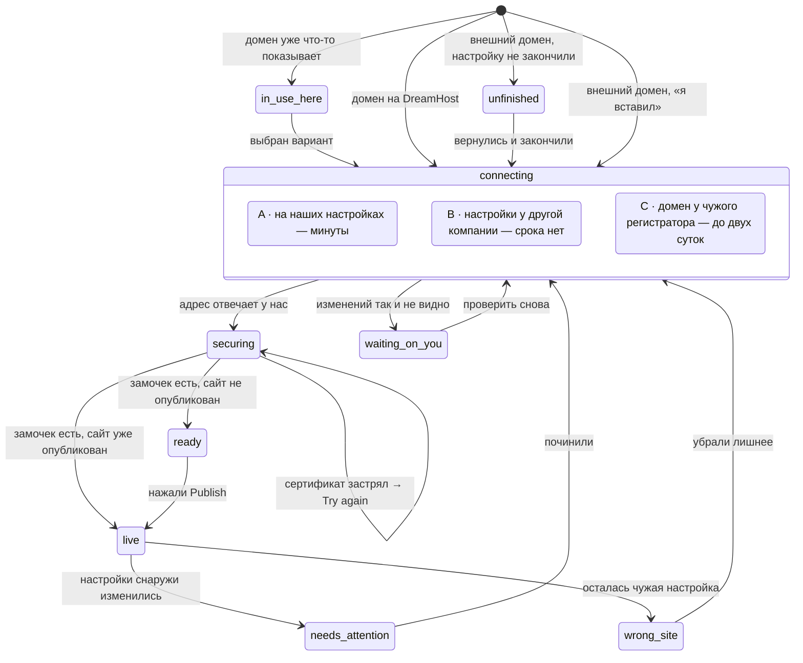

# Домены — стейт-машина подключения

> **Это тот дизайн-дэлаверабл, которого у фичи нет.** Счастливый путь нарисован; из
> тринадцати известных сбойных состояний **девять не нарисованы вовсе** (строки 1, 2, 3, 4,
> 6, 8, 9, 12, 13 — перечень в `research/connect.md` §6), **ещё два нарисованы частично**:
> `securing` (в Figma есть базовый вариант, «застряло» нет — а в прототипе своего экрана
> нет вообще, см. карточку) и `in-use-here` (гард есть, но с одним вариантом). По разбору
> 17 продуктов это примерно 40% реального трафика. Все тринадцать кто-то в категории
> называет — недостаёт именно НАШИХ фреймов.
>
> Файл описывает: имена состояний, когда каждое возникает, что человек видит, дословный
> EN-копирайт, глагол, откуда решение взято, и есть ли фрейм. Ниже — карта тринадцати
> сбоев на эти состояния, раздел про чеклист успеха, раздел про коллизии и список
> расхождений с тем, что стоит в прототипе сегодня.
>
> **Откуда здесь берутся сроки — и почему этот файл не назначает ни одного сам.** Язык
> ожидания задан `../../product/COPY-RULES.md` §5 (таблица «путь → честное окно» плюс
> список запрещённых обещаний), а значения — регистром `../../product/FACTS.md`: три
> честных окна разобраны в §2.16, порядок «замочек приходит последним» — в §2.17. В прозе
> этого документа срок цитируется по ID — **DH-217** (распространение зависит от типа
> изменения), **DH-203** (смена того, куда указывает домен, у другой компании), **DH-301**
> (замочек), **CMP-035** (как то же самое формулируют в поле) — и не пересказывается
> минутами: правило `../../decisions/0004-facts-live-once-in-a-register.md` («Факты живут
> один раз в регистре со стабильными ID»). Число внутри EN-строки — это уже продуктовый
> копирайт; оно обязано совпадать с процитированным рядом, а если расходится — прав
> регистр, а не строка.

## Стандарт, по которому это сделано

Лучшие в категории имена состояний говорят, **что делать дальше**. Худшие говорят, **что
думает сервер**.

- **Эталон — Lovable, восемь состояний, глагол на каждом.** Их главные находки, которые мы
  забираем целиком: `Unable to verify` — это *спроектированный таймаут в один час*, а не
  ошибка (бесконечное ожидание превращается в точку решения); `Ready` — корректно
  настроенный домен на неопубликованном проекте показывает «готово», а не «сломано»;
  `Retry` на этапе сертификата, потому что альтернатива — «удалите и добавьте заново» —
  сбрасывает всё и является худшим советом в этой категории.
- **Анти-эталон — Vercel `Invalid Configuration` и Netlify `Awaiting External DNS`.**
  Оба называют мнение машины. Оба породили многолетние ветки на форумах вида
  *"Domain Showing 'Invalid Configuration' Despite Correct Setup"*.
- **Слишком грубо — Bolt: `Secure` / `Pending` / `Warning`.** Под `Warning` попадает всё
  от лишней записи до мёртвого сертификата, то есть не попадает ничего.

Правила, которые из этого следуют и которые нельзя нарушать:

1. **У каждого состояния — ровно один глагол.** Исключение одно: `securing`, где глагола
   нет намеренно («от вас ничего не требуется» — это тоже сообщение).
2. **Вина — на ситуации, никогда на человеке.** У Lovable честная оговорка: на
   регистраторах с долгим распространением один проход через таймаут — нормальный исход
   *правильной* настройки. Значит формулировка «мы пока не видим изменений», а не «вы
   что-то сделали не так».
3. **Ни одного технического слова в пользовательских строках.** Нет DNS, nameserver,
   A record, CNAME, 301, «SSL certificate», «propagation», «verification record».
   Единственный санкционированный технический токен во всём флоу — «(SSL)» в каноническом
   чеклисте успеха, и он под вопросом (`OPEN-QUESTIONS.md` 09).
   Отдельное разрешение: **чужой интерфейс можно называть по тому, как он выглядит** —
   «the orange cloud next to {domain}» законно, «disable the Cloudflare proxy» нет.
4. **Состояние всегда говорит, что сайт цел.** У человека сломался адрес, а не работа.
   Строка «ваш сайт по-прежнему здесь: {staging}» стоит дорого и ничего не стоит.
5. **Никогда «удалите и добавьте заново».** Это сброс всего прогресса.
6. **Ни одного срока без ID.** Строка, обещающая время, стоит на ряде регистра
   (**DH-217** / **DH-203** / **DH-301**); срок, которого в регистре нет, в строку не идёт.
   Это не гигиена, а разбор уже случившегося сбоя: одна строка «usually a few minutes»
   стояла на всех путях подключения, включая тот, по которому документация DreamHost
   обещает окно, измеряемое сутками (**DH-203**, разбор — FACTS §2.16). Отдельно: **время, которое человек тратит сам**
   («about five minutes» на вставку двух строк), — это не срок ожидания и ID не требует;
   путать их в одной карточке нельзя.

Плейсхолдеры: `{domain}` — адрес, `{registrar}` — где домен зарегистрирован (данные
уровня реестра, RDAP — надёжны для всех gTLD; для ccTLD, где регистратора не видно,
деградируем до "another provider"), `{provider}` — **компания, чьи настройки домен
слушает сейчас** (канонический случай — Cloudflare; это НЕ обязательно `{registrar}`, и
путать их нельзя: **STD-006** — домен, зарегистрированный в GoDaddy и переставленный
куда-то ещё, определится не как GoDaddy), `{staging}` — бесплатный адрес превью,
`{date}` — дата.

## Карта машины

**Три вещи в этой карте стоят там, где раньше стояли неверно.**

1. **`connecting` — составное состояние из трёх вариантов, а не одно.** Топология у них
   общая, копирайт и обещанный срок — нет; разбор ниже, в карточке состояния.
2. **Застрявший сертификат остаётся внутри `securing`** (петля на себя, глагол `Try
   again`), а не уезжает в `needs-attention`. Раньше диаграмма рисовала переход, которого
   нет ни в карточке состояния, ни в карте сбоев: `needs-attention` — это «работало и
   перестало», а здесь ещё ничего не начинало работать.
3. **У `live` два входа, а не один.** `ready → live` — это нажатый Publish. Но если сайт
   уже опубликован, а домен подключают к нему потом, то `securing → live`: замочек — это
   последнее, что должно случиться, и в этом случае после него `ready` не наступает
   никогда.

`waiting-on-you` достижимо только из вариантов B и C: в варианте A ждать нечего, потому
что изменение применяем мы сами (**DH-218**).

**Куда можно попасть из какого сценария.** Половина состояний недостижима для домена,
который лежит в аккаунте DreamHost, — и это ровно то, что делает наш сценарий 2 сильным.

| Состояние | `dh-free` | `dh-in-use` | `dh-external-ns` | `external-dc` | `external-manual` |
|---|---|---|---|---|---|
| `in-use-here` | — | **да, всегда** | — | — | — |
| `connecting` · A `in-account` | да (секунды) | да | — | — | — |
| `connecting` · B `managed-elsewhere` | — | — | **да, всегда** | — | — |
| `connecting` · C `at-another-company` | — | — | — | да | да |
| `unfinished` | — | — | да | да | **да, часто** |
| `waiting-on-you` | — | — | да | да | **да, часто** |
| `securing` | да | да | да | да | да |
| `ready` | **да, часто** | да | да | да | да |
| `live` | да | да | да | да | да |
| `needs-attention` | редко | редко | да | да | да |
| `wrong-site` | — | да | да | да | да |

---

# Состояния

## `connecting` — одно состояние, три варианта копирайта

**Когда возникает.** Человек нажал Connect (домен на DreamHost) или «я вставил обе
строки» (внешний домен). Дальше начинается ожидание — и вот его-то нельзя описывать одной
строкой.

**Почему вариантов три, а не один.** Строка «Usually a few minutes» стояла на всех путях
подключения, и на двух из трёх она неправда: FACTS §2.16 держит это как зафиксированное
противоречие и называет три честных окна, `../../product/COPY-RULES.md` §5 — как их
формулировать. Различает варианты не тон, а механика: **DH-218** — когда домен
управляется DreamHost, записи пишем мы сами, и внешнего изменения нет вообще; **DH-217** —
распространение зависит от типа изменения, а не от нашей скорости (наш собственный срок
жизни записи против кэшей провайдеров); **DH-203** — смена того, куда указывает домен, у
другой компании; **DH-308** — домен может быть нашим, а слушать не нас. Право на фразу
«a few minutes» есть ровно у одного варианта из трёх.

**Как это соотносится с таблицей в COPY-RULES §5.** Там четыре строки, и одна из них —
«изменение у другой компании» — склеивает два разных случая: тот, где мы пишем запись, но
слушают не нас (B), и тот, где человек меняет, куда указывает домен (C). Обещанный срок у
них разный, поэтому здесь строка разделена на две. COPY-RULES сам называет `STATES.md`
источником имён и строк состояний — значит расхождение решается в эту сторону, а таблица §5
уточняется следом.

**Общее для всех трёх.** Пульсирующая амбер-точка рядом с адресом, чеклист успеха с
первым пунктом в работе, кнопка обновления и явное разрешение уйти. Никаких блокировок:
панель можно закрыть и редактировать сайт дальше. И ни один из трёх не обещает письма
(**DH-311** — уведомление не подтверждено; честная пара «it goes live on its own» +
`Refresh status`).

---

### A · `connecting · in-account` — домен в аккаунте DreamHost, на наших настройках

**Оси прототипа.** `inventory: 'dh-free' | 'dh-in-use'`

**Что происходит на самом деле.** Изменение применяем мы сами, у себя (**DH-218**), и
собственный срок жизни записи у нас — минуты (**DH-217**). Снаружи менять нечего, ждать
нечего, состояние промелькнёт. **Это единственный вариант, которому COPY-RULES §5
разрешает произносить «a few minutes», и он это право заработал.**

**EN copy**
> **Connecting {domain}**
> Usually a few minutes. Keep editing — it goes live on its own.

**Глагол.** `Refresh status` · второй кнопкой `Keep editing`

**Откуда.** Lovable `Verifying` с действием *Check status* (**CMP-009**); разрешение уйти —
из publish-флоу Lovable, где копирайт прямо отпускает пользователя.

**В Figma.** Да (③ / ⑥). **В прототипе** — `StatusScreen`, стадия 0, но это единственный
вариант, который там есть: та же строка печатается и на B, и на C (см. «Расхождения с
прототипом»).

---

### B · `connecting · managed-elsewhere` — домен наш, но его настройки живут у другой компании

**Оси прототипа.** `inventory: 'dh-external-ns'` (канонический случай — Cloudflare)

**Что происходит на самом деле.** Домен зарегистрирован у нас, а отвечает за него другая
компания — поэтому **то, что мы напишем у себя, просто не подействует** (**DH-308**). Это
не ожидание, а передача хода: пока не переключат там, не произойдёт ничего и никогда.
Значит этому варианту нельзя обещать не «пару минут», а **вообще никакой срок** — ведро 2
в FACTS §2.16.

**Что видит.** Не спиннер. Экран, который говорит: наша половина готова, осталась одна
перемена у названной компании — и сразу ведёт к ней. Тон — «вот где сейчас живут
настройки», а не «вы что-то сделали не так».

**EN copy**
> **One change left, over at {provider}**
> {domain} is set up on our side. It goes live as soon as {provider} starts sending visitors here.

Строка после того, как человек сказал, что переключил:
> Changes at {provider} can take up to six hours to reach everyone. Keep editing — we'll keep checking.

**Глагол.** `Show me what to change at {provider}` · второй кнопкой `Refresh status`

**Откуда.** Ведро 2 в FACTS §2.16 и **DH-308** — почему запись, написанная у нас, здесь не
авторитетна. Срок после перемены — **DH-217** (это изменение записи, а не смена того, куда
указывает домен: до шести часов у чужих кэшей, при нашем собственном сроке жизни записи в
минутах). Прямая ссылка в настройки названной компании — бесплатная половина Entri
(**STD-011**). Для Cloudflare сюда же приезжает оговорка про проксирующий режим
(**STD-004**) — она уже написана в `waiting-on-you`.

**В Figma.** Нет. **В прототипе** амбер-карточка в `OwnScreen` («This domain is managed at
Cloudflare») есть, а самого состояния нет: после Connect домен уходит в общий
`StatusScreen`, который и на этом пути обещает «a few minutes».

---

### C · `connecting · at-another-company` — домен у чужого регистратора

**Оси прототипа.** `inventory: 'external-dc' | 'external-manual'`

**Что происходит на самом деле.** Человек меняет у другой компании то, куда указывает его
домен. Документация DreamHost даёт по этой операции окно, которое измеряется сутками
(**DH-203**, механика — **DH-217**); наша собственная скорость здесь ни при чём, потому что
ждём мы чужие кэши. Формулировку берём из поля — **CMP-035** (Replit, Shopify): быть
расплывчатее Shopify — не доброта, а трусость.

**Что видит.** То же, что в варианте A, но с честным окном и без слова «минуты». Уйти
можно так же — и именно здесь это важнее всего, потому что ждать придётся дольше всего.

**EN copy**
> **Connecting {domain}**
> Usually under an hour, sometimes up to two days. Keep editing — it goes live on its own.

**Глагол.** `Refresh status` · второй кнопкой `Keep editing`

**Откуда.** COPY-RULES §5, строка «изменение у другой компании»; **DH-203** — само окно;
**CMP-035** — форма фразы.

⚠️ **Расхождение внутри самой цифры — решать дизайнеру, не мне.** COPY-RULES §5 остановился
на «up to two days» (по полю, **CMP-035**), а наша собственная документация обещает окно
на сутки длиннее (**DH-203**). Пока это не закрыто, «two days» — обещание, которого наш
худший случай не выполняет, то есть та же ошибка класса §2.16, только на сутки меньше.
Два выхода: сказать «up to three days» (честно, но мы одни в поле такие) или оставить
формулировку поля и переписать ведро 3 в FACTS §2.16, объяснив почему. Моя рекомендация —
«up to three days»: цитировать чужой SLA поверх своей документации — ровно то, из-за чего
этот раздел переписан.

---

**Общее для всех трёх и легко теряемое: замочек — это ЧЕТВЁРТОЕ ожидание, а не шаг
внутри этих.** Сертификат нельзя выпустить, пока адрес не начал отвечать у нас
(**DH-301**), поэтому `securing` начинается только там, где кончилось `connecting`, — и на
варианте C он стоит в очереди за сутками, а не за получасом. В интерфейсе это несёт третий
пункт чеклиста: он не тикает вместе со вторым (раздел «Канонический чеклист» ниже).

---

## `waiting-on-you`

**Когда возникает.** Прошёл примерно час, а изменений у регистратора мы так и не видим.
Это **спроектированный таймаут**, а не ошибка: дальше человек, скорее всего, смотрит не на
медленные записи, а на неправильные.

**Что видит.** Не ошибку. Экран, который показывает **сравнение**: что стоит у регистратора
сейчас и что там должно стоять, с кнопкой «скопировать» на правильном значении, и
инструкцию именно для его регистратора со ссылкой прямо в нужный раздел. Тон — «мы пока не
видим», а не «вы ошиблись».

**EN copy**
> **We can't see the change at {registrar} yet**
> It usually shows up within an hour. Here's what we're looking for — and what we found instead.

Блок сравнения (заголовки колонок): `What's there now` · `What it should be`
Подпись под несовпавшей строкой: `One character is off — copy it again and paste over what's there.`
Подпись под лишней строкой: `This one is left over from your old site. Remove it.`

Вариант для Cloudflare (сбой 5):
> In Cloudflare, click the orange cloud next to {domain} so it turns grey, then check again.

Вариант «прошло два дня» (сбой 12):
> **We still can't see the change at {registrar}**
> Two days is inside what this can take, so nothing is broken — but let's try the other way instead of waiting longer. It takes about five minutes and we'll walk you through it.

**Глагол.** `Show me what to paste` · второй кнопкой `Check again` · ссылкой
`Open your settings at {registrar} ↗` · в 48-часовом варианте `Try the other way`

**Откуда.** Таймаут в час — Lovable `Unable to verify` (**CMP-009**), переименованный так,
чтобы винить ситуацию. Вариант Cloudflare — **STD-004** (пока включён проксирующий режим,
проверка не пройдёт никогда, и назвать это надо тем, как это выглядит на экране, а не
механизмом).
**48-часовой вариант смягчён осознанно:** заголовок «Two days is longer than this should
take» противоречил нашему же факту — по **DH-203** двое суток лежат ВНУТРИ
задокументированного окна, то есть строка называла нормальный исход поломкой. Новая
формулировка говорит «мы всё ещё не видим», а не «слишком долго». Оговорка «about five
minutes» в ней — это время, которое человек потратит сам, а не обещанный срок ожидания
(правило 6 выше). Инструкции под конкретного регистратора и прямая ссылка в его настройки — это
ценная половина Entri, которую можно построить без Entri (`research/connect.md` §12.2).
**Сравнение вместо таблицы записей — наше:** ни один конкурент этого не делает, а оно
превращает невидимые сбои класса «то, что есть, ≠ то, что нужно» в один видимый — это строки
1, 2, 3 и 4 каталога, которые живут здесь (`OPEN-QUESTIONS.md` 03); `research/connect.md` §12.3
добавляет к тому же классу строку 6, у которой в нашем флоу дома нет вообще. Число не
пересказывать — считать по перечню.

**В Figma.** Нет. Один из трёх фреймов, которые надо рисовать первыми.

---

## `unfinished`

**Когда возникает.** Настройку внешнего домена начали и не закончили: экран с двумя
строками открывали, но у регистратора ничего не менялось и человек ушёл. Домен остаётся в
списке.

**Что видит.** Строку в списке доменов, помеченную как незавершённую, и карточку, которая
возвращает ровно туда, где он остановился. Плюс честный срок, если он у нас есть.

**EN copy**
> **Finish connecting {domain}**
> You started this on {date} and nothing has changed at {registrar} yet. Pick up where you left off — it takes about five minutes.

Строка срока (значение — открытый вопрос 05):
> We'll keep your setup here for {N} more days.

**Глагол.** `Finish setup` · второй кнопкой `Remove`

**Откуда.** Squarespace молча отвязывает домен, если подтверждение так и не появилось
(**CMP-036** — срок у них назван в документации, но **в интерфейсе это молчаливый убийца**).
Состояние делает срок видимым. Добавлено к списку из `research/connect.md` §12 специально, чтобы
сбои 2 и 13 имели дом.

**В Figma.** Нет.

---

## `securing`

**Когда возникает.** Адрес уже отвечает у нас, владение подтверждено — выпускается
сертификат (в интерфейсе — «замочек»). **Раньше этого момента состояние возникнуть не
может, и это не деталь реализации, а порядок:** сертификат нельзя выпустить, пока домен не
указывает на DreamHost (**DH-301**). Отсюда и фиксированный порядок пунктов в чеклисте, и
петля на себя в карте вместо перехода в `needs-attention`.

**Что видит.** Продолжение того же экрана: второй пункт чеклиста закрыт, третий в работе.
**Кнопки нет** — и это сообщение: от него ничего не требуется.

**EN copy**
> **Almost there — turning on the padlock**
> Nothing for you to do. This usually takes ten to thirty minutes, sometimes a little longer.

Вариант «застряло» (сбой 7):
> **This is taking longer than it should**
> Your setup is fine — we just need to try the padlock again. Nothing you did will be lost.

**Глагол.** Нет, намеренно. В варианте «застряло» — `Try again` (и **никогда** «удалите и
добавьте заново»).

**Откуда.** Lovable `Setting up` — дословно *"nothing for you to do"*; их же
`Stalled`/`Failed` с *Retry* и прямым предупреждением, что удалять и добавлять заново не
надо (**CMP-009**).

**Про срок — здесь стоял чужой SLA.** Строка обещала «about 15 minutes»: это цифра Figma
Sites (**CMP-035**), стоявшая прямо поверх нашей собственной проверенной — **DH-301**,
и наша шире. Теперь в строке наша. У **CMP-035** правильно взять **форму** фразы («число,
потом честный хвост»), а не число: своё число у нас есть.

**Чего эта строка не говорит и не должна.** На варианте C (`connecting · at-another-company`)
замочек стоит в очереди за окном **DH-203**, то есть за сутками, а не за получасом:
«ten to thirty minutes» — срок самого выпуска, и он начинает тикать только после того, как
адрес начал отвечать. Поэтому на внешнем пути `securing` — **отдельный экран после**
`connecting`, а не подпись под ним, и обещание длительности не появляется до того, как
состояние наступило.

⚠️ **DH-301 честен ровно наполовину, и это надо знать перед показом.** Его число — время
установки сертификата в панели DreamHost, а не замер публикации Remixer; FACTS §3 держит
это открытым пунктом с названным владельцем («время один настоящий publish и запиши дату»).
Пока замера нет, эта строка — лучшее, что у нас есть, но она не измерена на нашем флоу.

⚠️ **И встречное расхождение, чтобы строку не «починили» обратно.** COPY-RULES §5 в строке
про замочек всё ещё говорит «within half an hour of connecting» и помечает **DH-301** как
неподтверждённый — регистр это уже закрыл (20.08.2026), и там же появился порядок, которого
в формулировке §5 нет: «of connecting» звучит как «полчаса от нажатия», а на варианте C это
полчаса **после** окна **DH-203**. Для состояния действует строка отсюда: COPY-RULES §5 сам
называет `STATES.md` источником имён и дословных строк.

**В Figma.** Частично: базовый вариант нарисован, «застряло» — нет.

**В прототипе — НЕТ, и это не «частично».** Стадия `verifying` в `StatusScreen`
(`prototype/src/modules/domains/DomainsSurface.tsx`) перерисовывает экран `Connecting`
целиком: то же надглавие «Connecting», та же строка «Usually a few minutes» и те же две
кнопки — меняется ровно один тик в чеклисте. Строки «Almost there — turning on the
padlock» в прототипе не существует нигде, а две кнопки прямо нарушают правило этого
состояния («кнопки нет — и это сообщение»).

---

## `ready`

**Когда возникает.** Адрес настроен и работает, **но проект ещё не опубликован**.

**Что видит.** Не ошибку и не спиннер. Спокойное «всё готово, остался один шаг» с синей
кнопкой Publish и явным «это бесплатно».

**EN copy**
> **{domain} is ready — publish to put your site on it**
> Your address is set up. Visitors will see your site the moment you publish. Publishing is free.

**Глагол.** `Publish` (основное действие, синее)

**Откуда.** Lovable `Ready`. **Это, вероятно, самое частое состояние у новичка во всём
флоу** и одно из двух, которых у нас нет вообще: человек подключает домен, никогда не
нажимает Publish и делает вывод, что всё сломано. У нас риск выше, чем у Lovable: они
вообще не дают подключить домен до первой публикации (*"Publish your project before
connecting a custom domain"*), а наш Launchpad предлагает домен сразу — значит попасть
сюда легче.

**В Figma.** Нет. Первый фрейм в очереди.

---

## `live`

**Когда возникает.** Домен работает, сайт опубликован, замочек есть.

**Что видит.** Зелёная точка, адрес, закрытый чеклист успеха в **фиксированном порядке** и
приглашение поделиться — успех должен толкать к распространению, а не просто
подтверждать.

**EN copy**
> **Your site is live at {domain}**
> Secure padlock on · anyone can visit. Share it to get your first visitors.

Канонический чеклист (порядок не меняется никогда):
> `Domain settings updated` · `Connected to your site` · `Security (SSL) on`

⚠️ Третий пункт закрывается **позже** второго, а не вместе с ним: между ними стоит целое
состояние (`securing`). Стадии — в разделе «Канонический чеклист» ниже; в прототипе сейчас
оба пункта тикают одновременно, и это зафиксированное противоречие (FACTS §2.17).

**Глагол.** `Visit site ↗` · рядом `Copy link`

**Откуда.** Lovable state 3: *"Your website is live"* / *"Share it to get your first
visitors."* — их успех продаёт распространение, и это лучший копирайт в категории. Наше
собственное решение: в самом ценном слоте панели стоит живая кнопка, а не мёртвая
задизейбленная (у Lovable там `Publish changes` в disabled — слот потрачен зря).

**В Figma.** Да. В прототипе — стадия 2.

---

## `needs-attention`

**Когда возникает.** Работало и перестало: настройки у регистратора изменились, домен
переставили на другие серверы имён, регистратор «помог» и сбросил что-то сам.

**Что видит.** Амбер (единственное место наряду со stale-точкой публикации, где вообще
используется амбер), дату, когда сломалось, и — обязательно — что сайт цел и по-прежнему
доступен на бесплатном адресе.

**EN copy**
> **{domain} stopped showing your site**
> Something changed at {registrar} on {date}. Your site is safe — it's still at {staging}.

**Глагол.** `Fix this` (ведёт в сравнение из `waiting-on-you`)

**Откуда.** Lovable `Offline`. Эмоциональная половина — наша: сбой долгохвостый, но
переживается тяжело, и первая мысль человека «я потерял сайт» должна быть снята в первой же
строке.

**В Figma.** Нет. **В прототипе ось `unreachable` существует, а экрана нет** — состояние
проваливается в ветку «Connecting» и врёт человеку (`DECISIONS.md` 26 «Известный долг:
`unreachable` есть в осях, экрана нет»).

---

## `wrong-site`

**Когда возникает.** По адресу открывается не тот сайт — у части посетителей или у всех.
Причина почти всегда одна: у регистратора осталась настройка от прежнего хостера.

**Что видит.** Прямую формулировку проблемы глазами посетителя, а не описание записи.

**EN copy**
> **{domain} is showing a different site**
> An older setting at {registrar} is still sending some visitors somewhere else. Remove it and your site takes over.

**Глагол.** `Point it here`

**Откуда.** У Lovable это отдельная страница помощи «my domain shows the wrong site».
Причины — сбои 3 и 4 (остатки от прежнего хостера, забытая IPv6-запись); для новичка они
**невидимы**, поэтому это состояние — единственный способ, которым он о них вообще узнает.
Имя изменено: в `research/connect.md` §12 состояние называлось `taken-over`, что читается как
захват домена, то есть как инцидент безопасности (`DECISIONS.md` 25 «Состояния
подключения названы; `taken-over` переименовано в `wrong-site`»).

**В Figma.** Нет.

---

## `in-use-here` — коллизия внутри аккаунта

Полный разбор — в разделе «Коллизии» ниже; здесь только карточка состояния.

**Когда возникает.** Домен, который человек выбрал, уже что-то показывает: WordPress,
парковку, старый сайт билдера. **Для нас это базовый случай, а не пограничный.**

**EN copy**
> **{domain} already shows a website**
> Choose what visitors see. Nothing is deleted either way.

**Глагол.** Два названных варианта, каждый со своей кнопкой (см. ниже). Никакого одиночного
«вы уверены?».

**В Figma.** Частично: гард с правильным тоном есть, но с одним вариантом.

---

## `elsewhere-in-dreamhost` — домен в другом аккаунте DreamHost

**Когда возникает.** Домен есть, он у DreamHost, но принадлежит другому аккаунту (жена,
бывший подрядчик, старая регистрация на другой email).

**Состояние названо, копирайт не принят** — потому что мы не знаем механизма (нужна
политика: пускаем ли по подтверждению владения, зовём ли поддержку, есть ли самообслуживание).
`OPEN-QUESTIONS.md` 06.

Каркас, от которого отталкиваться:
> **{domain} is in a different DreamHost account**
> …

**Откуда.** Wix для кросс-аккаунтного случая говорит прямо: *"This domain is associated
with another Wix account. To connect your domain, you need to remove it from the other
account."* Shopify упирается в поддержку с доказательством владения — многолетняя боль
сообщества, повторять нельзя. У Vercel/Lovable это тупик, где пользователь даже не видит,
какой проект держит домен.

---

# Канонический чеклист: три пункта, четыре стадии

Три строки задаёт `../../product/COPY-RULES.md` §4, и порядок в них — это и есть
информация: замочек приходит последним. Значит **стадий у чеклиста на одну больше, чем
пунктов**, и пропущенная стадия — ровно та, ради объяснения которой чеклист существует.

| Стадия | Состояние | `Domain settings updated` | `Connected to your site` | `Security (SSL) on` |
|---|---|---|---|---|
| 0 | `connecting` (любой из трёх вариантов) | в работе | — | — |
| 1 | `connecting`, изменение увидено | ✓ | в работе | — |
| 2 | **`securing`** | ✓ | ✓ | **в работе** |
| 3 | `live` | ✓ | ✓ | ✓ |

**Стадия 2 — это весь смысл чеклиста.** «Connected to your site» закрывается, когда адрес
начал отвечать; «Security (SSL) on» — когда установлен сертификат, и между этими двумя
событиями по **DH-301** проходит его собственное окно, а на варианте C перед ними обоими
стоит ещё и **DH-203**. Закрыть их одним движением — значит удалить состояние, которое
чеклист и должен показывать (зафиксировано как противоречие: FACTS §2.17).

**Что из этого следует для прототипа — это заявка, а не правка.**
`prototype/src/modules/domains/DomainsSurface.tsx`, `StatusScreen`: пункты 2 и 3 стоят на
одном условии `stage >= 2`, а сам `stage` умеет только три значения (`connecting` → 0,
`verifying` → 1, `live`/`multiple` → 2). Стадии 2 из таблицы выше там нет физически, и
починить это одной строкой нельзя: ось `world.domain` не различает «адрес отвечает» и
«замочек есть» — `verifying` играет обе роли. Нужны две вещи: **четвёртое значение стадии**
и **отдельное значение на оси `DomainState` под `securing`**.
⚠️ Это не правка кода: `prototype/src/state/world.ts` и `DomainsSurface.tsx` лежат вне зоны
этого документа. Запись стоит здесь, чтобы следующее изменение прототипа знало, что делать,
и чтобы правку не сделали наполовину — покрасить строку без стадии значит соврать точнее.

**Панель Publish задета тем же.** `prototype/src/modules/publish/PublishPanel.tsx` печатает
«Connecting — usually a few minutes» на всех трёх путях сразу (то же противоречие §2.16) и
не знает состояния `securing` вообще: `Refresh status` ведёт из `connecting` прямо в `live`,
где сразу стоит «Secure padlock on». То есть **появление замочка — событие, которого в
панели не видно**, и для новичка это склейка, читающаяся как «instantly secured» — обещание,
которое `../../product/POSITIONING.md` §7 запрещает именно по **DH-301**.

---

# Расхождения между этой машиной и прототипом

Читать вместе с таблицами статуса в `README.md` (там та же правда, но по экранам). Ни одна
строка ниже не является заявкой на правку кода в этом изменении — это перечень того, что
прототип сегодня говорит человеку не то, что решено здесь.

| # | Где | Что стоит в прототипе | Что должно быть |
|---|---|---|---|
| 1 | `StatusScreen`, стадия 0 | одна строка «Usually a few minutes» на всех путях | три варианта `connecting` (A/B/C выше); «a few minutes» разрешено только A |
| 2 | `StatusScreen`, стадия `verifying` | перерисовка экрана «Connecting»: то же надглавие, та же строка, те же **две** кнопки | `securing`: своя строка, свой срок (**DH-301**) и **ни одной кнопки** |
| 3 | `StatusScreen`, чеклист | «Connected to your site» и «Security (SSL) on» тикают вместе (`stage >= 2`) | четыре стадии из таблицы выше (FACTS §2.17) |
| 4 | `StatusScreen`, ось `unreachable` | значение есть, экрана нет — состояние проваливается в ветку «Connecting» и врёт | `needs-attention` (`DECISIONS.md` 26 «Известный долг: `unreachable` есть в осях, экрана нет») |
| 5 | `StatusScreen`, ось `multiple` | рендерится как `live` | у этого значения оси в машине **нет имени состояния**: либо назвать, либо убрать с оси |
| 6 | `OwnScreen`, `dh-in-use` | один страшный confirm «Replace site at {domain}» | два названных варианта с последствиями (`DECISIONS.md` 20 «Коллизию решает пользователь, а не поддержка») |
| 7 | `OwnScreen`, `dh-external-ns` | амбер-карточка про Cloudflare + «About 5 minutes» | карточка правильная; «5 минут» — это время работы человека, а не срок ожидания, и рядом с ним должен стоять вариант B, а не общий `connecting` |
| 8 | `PublishPanel` | «Connecting — usually a few minutes» на всех путях; `securing` не существует | см. раздел про чеклист выше |
| 9 | `prototype/src/state/flows.ts`, `connect-external` | шаг «Choosing how to connect» проигрывается в сценарии | экрана выбора способа нет и не будет до PO на Entri (`DECISIONS.md` 17 «Ручной путь — primary; one-click — помеченный вариант»). Это подпись для консоли, а не продуктовая строка, но на демо CEO она читается как обещание |

---

# Карта тринадцати сбоев на состояния

Нумерация — из `research/connect.md` §6. «Дом» = состояние, в котором сбой становится
видимым и получает глагол.

| # | Сбой | Дом | Что говорит копирайт |
|---|---|---|---|
| 1 | Проверочная строка вставлена с опечаткой или обрезана (у Lovable — *самая частая* причина бесконечного ожидания) | `waiting-on-you` | Сравнение показывает обе строки рядом: `One character is off — copy it again and paste over what's there.` |
| 2 | Вторую строку (подтверждение владения) не вставили вообще | `waiting-on-you`, если человек нажал «я вставил»; `unfinished`, если он не возвращался | `We only see one of the two lines. The second one is what proves {domain} is yours.` |
| 3 | Остались записи от прежнего хостера | `wrong-site`, а если они блокируют проверку — `waiting-on-you` | `This one is left over from your old site. Remove it.` |
| 4 | Забытая IPv6-запись: часть посетителей видит старый сайт | `wrong-site` | То же, что 3. **Для человека сбой невидим** — существует только через наше сравнение |
| 5 | У Cloudflare включён проксирующий режим | `waiting-on-you`, вариант Cloudflare | `In Cloudflare, click the orange cloud next to {domain} so it turns grey, then check again.` |
| 6 | Правило безопасности домена не даёт выпустить сертификат (CAA) | **дырка** — см. ниже | — |
| 7 | Сертификат застрял после успешной проверки | `securing`, вариант «застряло» | `Your setup is fine — we just need to try the padlock again. Nothing you did will be lost.` |
| 8 | Подключено, но никогда не опубликовано | `ready` | `{domain} is ready — publish to put your site on it` |
| 9 | Работало и перестало | `needs-attention` | `Something changed at {registrar} on {date}. Your site is safe — it's still at {staging}.` |
| 10 | Домен уже привязан в другом месте | `in-use-here` (свой аккаунт) · **`elsewhere-in-dreamhost` — дырка** (чужой аккаунт) | См. «Коллизии» |
| 11 | Почта умирает после подключения | **страховка до подключения**, не состояние; **пост-фактум — дырка** | В конфирме: `Your email at {domain} keeps working — we're bringing its settings across.` |
| 12 | Изменение у другой компании не видно больше двух суток | `waiting-on-you`, 48-часовой вариант — **дырка по существу** | `We still can't see the change at {registrar}` → `let's try the other way instead of waiting longer` |
| 13 | Настройку бросили → домен молча отвязывается | `unfinished` + видимый срок | `We'll keep your setup here for {N} more days.` |

## Дырки — назвать, а не замазать

**Сбой 6 (правило безопасности блокирует сертификат) — дома нет.** Единственный сбой,
который нельзя сформулировать без технической строки и нельзя починить на нашей стороне.
Он редкий, но стопроцентно тупиковый: пока правило стоит, замочка не будет никогда.
Предлагаемый минимум — единственное место во всём флоу, где мы честно уходим в поддержку:

> **{domain} has a security rule that blocks the padlock**
> It's a setting on the domain itself, not on your site. Our team can clear it — usually in a few minutes.
> `Chat with support`

Решать дизайнеру и инженерии вместе (`OPEN-QUESTIONS.md` 11): либо это единственное
разрешённое исключение из правила де-жаргона, либо это единственный передаваемый в
поддержку случай.

**Сбой 12 — дом формальный, а по существу дырки две.** Строка «попробуем другим способом»
предполагает, что у нас есть второй способ. Мы не решили, предлагаем ли мы вообще два
пути подключения внешнего домена или один (`OPEN-QUESTIONS.md` 03 про сравнение — часть
того же выбора). Пока второго пути нет, у 48-часового варианта нет действия — только
поддержка.

**Сбой 11 — половина дома.** Страховка до подключения спроектирована. Но состояния
«почта перестала работать после подключения» у нас нет, и обнаружить это мы не можем —
человек узнаёт об этом из того, что ему никто не пишет. Это самый разрушительный сбой в
списке (ломается бизнес, а не сайт), и он единственный, где дизайн бессилен без телеметрии.

**Сбой 10, кросс-аккаунтная половина — дырки нет только на бумаге.** Состояние названо,
копирайта нет, потому что нет политики.

**Сбои 1–4 живут в одном доме, и этот дом ещё не одобрен.** Все четыре закрываются
**сравнением** («вот что стоит / вот что должно стоять»). Если сравнение не принято
(`OPEN-QUESTIONS.md` 03), четыре самых частых сбоя остаются без дома, а `waiting-on-you`
вырождается в вежливый спиннер.

## Чего нет и не в этой машине

**Состояния «домен занят» в поиске.** Это не состояние подключения, а состояние поиска, но
это самое частое состояние доменного поиска вообще, и оно не нарисовано нигде
(`OPEN-QUESTIONS.md` 01). Тон брать у Hostinger/Wix (одна дружелюбная строка → сразу
альтернативы), не у GoDaddy (брокеридж), и не у Squarespace (сухой ярлык «unavailable»
без выхода). И там же — тихий поворот «Already yours? Connect it», которого нет ни у кого.

---

# Коллизии

## Наш случай — базовый, а не пограничный

Домены наших пользователей лежат в аккаунте DreamHost, который очень вероятно уже что-то
обслуживает: WordPress, парковочную страницу, сайт старого билдера. То есть у нас
`in-use-here` — **самый обычный путь**, а не редкость. У конкурентов это край, потому что
они не регистраторы для домена, купленного три года назад.

## Как это решают в поле

| Продукт | Что говорит | Чем кончается |
|---|---|---|
| **Wix** | Внутри аккаунта: «Assign to a Different Site» с двумя явными вариантами — *"Redirect it to the primary domain"* / *"Replace the current primary domain"*. Между аккаунтами: *"This domain is associated with another Wix account…"* | **Самообслуживание, лучшее в категории: назван результат каждого варианта** |
| **Squarespace** | *"This domain is already connected to another Squarespace site"* | Самообслуживание: отключить и подключить; для своих доменов есть «Move domain» |
| **Shopify** | *"This domain is already connected to another Shopify store."* | **Поддержка с доказательством владения** — задокументированная многолетняя боль |
| **Lovable / Vercel** | *"domain already exists under a different context"* | **Тупик:** пользователь даже не видит, какой проект держит домен |

## Что показываем мы

Один экран, два названных варианта, у каждого — последствие своими словами, и ни одного
одиночного «вы уверены?». Скрим накрывает всё, домен приколот сверху — нить не теряется.

> **{domain} already shows a website**
> Choose what visitors see. Nothing is deleted either way.

**Вариант A — основной**
> **Show this new site at {domain}**
> Your old site stays in your account, and you can switch back any time.
> `Use this site`

**Вариант B**
> **Keep the old site at {domain}**
> Your new site gets a different address, and visitors to {domain} keep seeing the old site.
> `Keep the old one`

Третьей строкой — `Cancel`.

**Открытое место в варианте B:** какой именно адрес получает новый сайт. `research/connect.md` §9
предлагает `www.{domain}`, но для новичка «сайт живёт на www, а на основном адресе старый»
— конструкция, которую трудно удержать в голове. Возможные ответы: остаться на бесплатном
`{staging}`, предложить поддомен, или вообще убрать вариант B и оставить «отмена».
Решение за дизайнером и инженерией (`OPEN-QUESTIONS.md` 07). До ответа рисуем вариант A
плюс `Cancel` — он честен и не обещает того, чего мы не спроектировали.

**Чего не делаем никогда.** Не отправляем в поддержку с доказательством владения (Shopify).
Не говорим «домен занят другим контекстом» (Vercel). Не показываем один страшный confirm
там, где есть выбор, — сейчас в прототипе стоит именно он («Replace site at {domain}»), и
это расхождение зафиксировано в `DECISIONS.md` 20 («Коллизию решает пользователь, а не
поддержка»).

**Тон гарда, который уже правильный** (не переписывать, только развернуть в два варианта):
*"Connecting will replace what visitors see at {domain}. Your files stay safe and you can
switch back."* — здесь есть и последствие, и обратимость.

---

# Что рисовать в первую очередь

Рекомендация ресёрча (`research/connect.md` §13.1) и моя: несколько фреймов сверху этого списка
закрывают большинство реального трафика.

**Нулевой приоритет — не фрейм, а строка.** Три варианта `connecting` (A/B/C) — это правка
копирайта в уже существующем экране, и она дешевле любого фрейма ниже, а исправляет
обещание, которое продукт не выполняет на двух путях из трёх (FACTS §2.16). То же про
строку `securing`: экран нарисован, в нём стоит чужое число (**CMP-035** вместо
**DH-301**). Это делается до того, как рисуется что-либо новое.

| Приоритет | Фрейм | Почему именно он |
|---|---|---|
| 1 | `ready` | Самое частое состояние у новичка. Подключил домен, не нажал Publish, решил, что сломалось |
| 2 | `waiting-on-you` со сравнением | Дом четырёх самых частых сбоев сразу. Плюс это наш единственный настоящий отрыв в этом флоу |
| 3 | `needs-attention` | В прототипе ось уже есть, экран врёт. Плюс самая высокая эмоция на единицу трафика |
| 4 | `securing` как **отдельный** экран (стадия 2 чеклиста) | Без него замочек не существует как событие: сейчас его приход не видно ни в поверхности доменов, ни в панели Publish |
| 5 | `connecting · managed-elsewhere` (вариант B) | Единственное состояние, которое не пройдёт само **никогда**, и единственное, где мы обязаны отдать ход |
| 6 | `in-use-here` с двумя вариантами | Наш базовый случай |
| 7 | `unfinished` | Дешёвый фрейм, спасает молча умирающие настройки |
| 8 | `wrong-site` · `securing` «застряло» | Реже, но без них человек остаётся вообще без объяснения |
