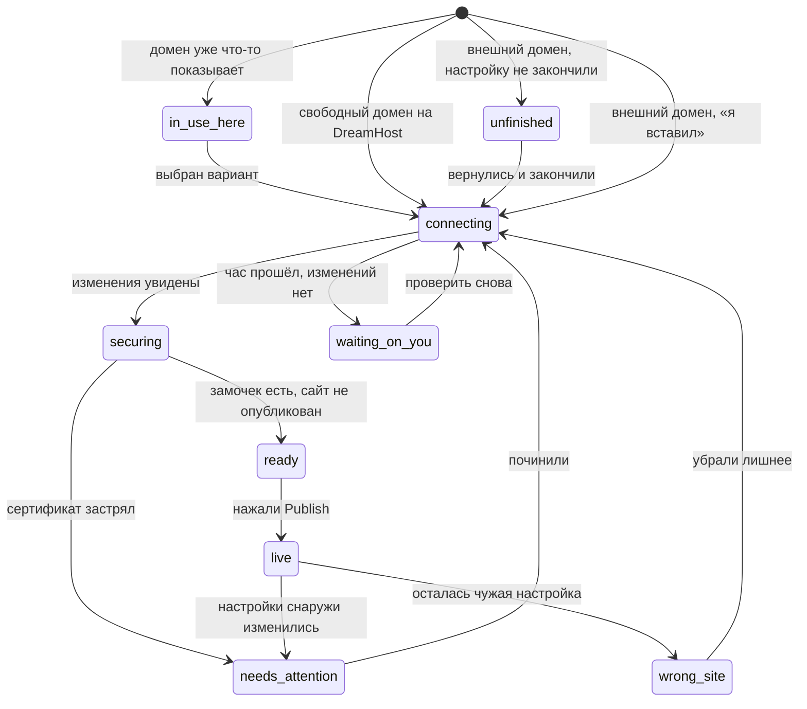

# Домены — стейт-машина подключения

> **Это тот дизайн-дэлаверабл, которого у фичи нет.** Счастливый путь нарисован; ни одно
> из тринадцати известных сбойных состояний — нет. По разбору 17 продуктов это примерно
> 40% реального трафика (`research/connect.md` §6).
>
> Файл описывает: имена состояний, когда каждое возникает, что человек видит, дословный
> EN-копирайт, глагол, откуда решение взято, и есть ли фрейм. Ниже — карта тринадцати
> сбоев на эти состояния и раздел про коллизии.

## Стандарт, по которому это сделано

Лучшие в категории имена состояний говорят, **что делать дальше**. Худшие говорят, **что
думает сервер**.

- **Эталон — Lovable, восемь состояний, глагол на каждом.** Их главные находки, которые мы
  забираем целиком: `Unable to verify` — это *спроектированный таймаут в один час*, а не
  ошибка (бесконечное ожидание превращается в точку решения); `Ready` — корректно
  настроенный домен на неопубликованном проекте показывает «готово», а не «сломано»;
  `Retry` на этапе сертификата, потому что альтернатива — «удалите и добавьте заново» —
  сбрасывает всё и является худшим советом в этой категории.
- **Анти-эталон — Vercel `Invalid Configuration` и Netlify `Awaiting External DNS`.**
  Оба называют мнение машины. Оба породили многолетние ветки на форумах вида
  *"Domain Showing 'Invalid Configuration' Despite Correct Setup"*.
- **Слишком грубо — Bolt: `Secure` / `Pending` / `Warning`.** Под `Warning` попадает всё
  от лишней записи до мёртвого сертификата, то есть не попадает ничего.

Правила, которые из этого следуют и которые нельзя нарушать:

1. **У каждого состояния — ровно один глагол.** Исключение одно: `securing`, где глагола
   нет намеренно («от вас ничего не требуется» — это тоже сообщение).
2. **Вина — на ситуации, никогда на человеке.** У Lovable честная оговорка: на
   регистраторах с долгим распространением один проход через таймаут — нормальный исход
   *правильной* настройки. Значит формулировка «мы пока не видим изменений», а не «вы
   что-то сделали не так».
3. **Ни одного технического слова в пользовательских строках.** Нет DNS, nameserver,
   A record, CNAME, 301, «SSL certificate», «propagation», «verification record».
   Единственный санкционированный технический токен во всём флоу — «(SSL)» в каноническом
   чеклисте успеха, и он под вопросом (`OPEN-QUESTIONS.md` 09).
   Отдельное разрешение: **чужой интерфейс можно называть по тому, как он выглядит** —
   «the orange cloud next to {domain}» законно, «disable the Cloudflare proxy» нет.
4. **Состояние всегда говорит, что сайт цел.** У человека сломался адрес, а не работа.
   Строка «ваш сайт по-прежнему здесь: {staging}» стоит дорого и ничего не стоит.
5. **Никогда «удалите и добавьте заново».** Это сброс всего прогресса.

Плейсхолдеры: `{domain}` — адрес, `{registrar}` — где домен зарегистрирован (данные
уровня реестра, RDAP — надёжны для всех gTLD; для ccTLD, где регистратора не видно,
деградируем до "another provider"), `{staging}` — бесплатный адрес превью, `{date}` — дата.

## Карта машины

**Куда можно попасть из какого сценария.** Половина состояний недостижима для домена,
который лежит в аккаунте DreamHost, — и это ровно то, что делает наш сценарий 2 сильным.

| Состояние | `dh-free` | `dh-in-use` | `dh-external-ns` | `external-dc` | `external-manual` |
|---|---|---|---|---|---|
| `in-use-here` | — | **да, всегда** | — | — | — |
| `connecting` | да (секунды) | да | да | да | да |
| `unfinished` | — | — | да | да | **да, часто** |
| `waiting-on-you` | — | — | да | да | **да, часто** |
| `securing` | да | да | да | да | да |
| `ready` | **да, часто** | да | да | да | да |
| `live` | да | да | да | да | да |
| `needs-attention` | редко | редко | да | да | да |
| `wrong-site` | — | да | да | да | да |

---

# Состояния

## `connecting`

**Когда возникает.** Человек нажал Connect (домен на DreamHost) или «я вставил обе
строки» (внешний домен). Мы применяем изменения и/или ждём, пока их станет видно снаружи.
Для домена в аккаунте DreamHost это секунды и состояние промелькнёт; для внешнего — от
минут до часа.

**Что видит.** Пульсирующая амбер-точка рядом с адресом, чеклист успеха с первым пунктом
в работе, кнопка обновления и явное разрешение уйти. Никаких блокировок: панель можно
закрыть, редактировать сайт дальше.

**EN copy**
> **Connecting {domain}**
> Usually a few minutes. Keep editing — it goes live on its own.

**Глагол.** `Refresh status` · второй кнопкой `Keep editing`

**Откуда.** Lovable `Verifying` с действием *Check status*; честность про время — от
Replit («a few minutes up to 48 hours»). Разрешение уйти — из publish-флоу Lovable, где
копирайт прямо отпускает пользователя.

**В Figma.** Да (③ / ⑥). В прототипе — `StatusScreen`, стадия 0.

---

## `waiting-on-you`

**Когда возникает.** Прошёл примерно час, а изменений у регистратора мы так и не видим.
Это **спроектированный таймаут**, а не ошибка: дальше человек, скорее всего, смотрит не на
медленные записи, а на неправильные.

**Что видит.** Не ошибку. Экран, который показывает **сравнение**: что стоит у регистратора
сейчас и что там должно стоять, с кнопкой «скопировать» на правильном значении, и
инструкцию именно для его регистратора со ссылкой прямо в нужный раздел. Тон — «мы пока не
видим», а не «вы ошиблись».

**EN copy**
> **We can't see the change at {registrar} yet**
> It usually shows up within an hour. Here's what we're looking for — and what we found instead.

Блок сравнения (заголовки колонок): `What's there now` · `What it should be`
Подпись под несовпавшей строкой: `One character is off — copy it again and paste over what's there.`
Подпись под лишней строкой: `This one is left over from your old site. Remove it.`

Вариант для Cloudflare (сбой 5):
> In Cloudflare, click the orange cloud next to {domain} so it turns grey, then check again.

Вариант «прошло два дня» (сбой 12):
> **Two days is longer than this should take**
> Something isn't reaching us. Let's try the other way — it takes about five minutes and we'll walk you through it.

**Глагол.** `Show me what to paste` · второй кнопкой `Check again` · ссылкой
`Open your settings at {registrar} ↗` · в 48-часовом варианте `Try the other way`

**Откуда.** Таймаут в час — Lovable `Unable to verify`, переименованный так, чтобы винить
ситуацию. Инструкции под конкретного регистратора и прямая ссылка в его настройки — это
ценная половина Entri, которую можно построить без Entri (`connect.md` §12.2).
**Сравнение вместо таблицы записей — наше:** ни один конкурент этого не делает, а оно
закрывает четыре невидимых сбоя одним видимым (`connect.md` §12.3).

**В Figma.** Нет. Один из трёх фреймов, которые надо рисовать первыми.

---

## `unfinished`

**Когда возникает.** Настройку внешнего домена начали и не закончили: экран с двумя
строками открывали, но у регистратора ничего не менялось и человек ушёл. Домен остаётся в
списке.

**Что видит.** Строку в списке доменов, помеченную как незавершённую, и карточку, которая
возвращает ровно туда, где он остановился. Плюс честный срок, если он у нас есть.

**EN copy**
> **Finish connecting {domain}**
> You started this on {date} and nothing has changed at {registrar} yet. Pick up where you left off — it takes about five minutes.

Строка срока (значение — открытый вопрос 05):
> We'll keep your setup here for {N} more days.

**Глагол.** `Finish setup` · второй кнопкой `Remove`

**Откуда.** Squarespace отвязывает домен через 15 дней, если проверочная запись так и не
появилась — они называют это в документации, но **в интерфейсе это молчаливый убийца**.
Состояние делает срок видимым. Добавлено к списку из `connect.md` §12 специально, чтобы
сбои 2 и 13 имели дом.

**В Figma.** Нет.

---

## `securing`

**Когда возникает.** Изменения увидены, владение подтверждено, выпускается сертификат
(в интерфейсе — «замочек»).

**Что видит.** Продолжение того же экрана: второй пункт чеклиста закрыт, третий в работе.
**Кнопки нет** — и это сообщение: от него ничего не требуется.

**EN copy**
> **Almost there — turning on the padlock**
> Nothing for you to do. This usually takes about 15 minutes, sometimes a little longer.

Вариант «застряло» (после ~30 минут, сбой 7):
> **This is taking longer than it should**
> Your setup is fine — we just need to try the padlock again. Nothing you did will be lost.

**Глагол.** Нет, намеренно. В варианте «застряло» — `Try again` (и **никогда** «удалите и
добавьте заново»).

**Откуда.** Lovable `Setting up` — дословно *"nothing for you to do"*; их же
`Stalled`/`Failed` с *Retry* и прямым предупреждением, что удалять и добавлять заново не
надо. Честность про время — из документации Figma: *"typically takes up to 15 minutes, but
can sometimes require additional time"*. Наш собственный факт: Let's Encrypt — 10–30 минут,
значит «мгновенно защищено» обещать нельзя.

**В Figma.** Частично: базовый вариант есть как стадия `verifying`, «застряло» — нет.

---

## `ready`

**Когда возникает.** Адрес настроен и работает, **но проект ещё не опубликован**.

**Что видит.** Не ошибку и не спиннер. Спокойное «всё готово, остался один шаг» с синей
кнопкой Publish и явным «это бесплатно».

**EN copy**
> **{domain} is ready — publish to put your site on it**
> Your address is set up. Visitors will see your site the moment you publish. Publishing is free.

**Глагол.** `Publish` (основное действие, синее)

**Откуда.** Lovable `Ready`. **Это, вероятно, самое частое состояние у новичка во всём
флоу** и одно из двух, которых у нас нет вообще: человек подключает домен, никогда не
нажимает Publish и делает вывод, что всё сломано. У нас риск выше, чем у Lovable: они
вообще не дают подключить домен до первой публикации (*"Publish your project before
connecting a custom domain"*), а наш Launchpad предлагает домен сразу — значит попасть
сюда легче.

**В Figma.** Нет. Первый фрейм в очереди.

---

## `live`

**Когда возникает.** Домен работает, сайт опубликован, замочек есть.

**Что видит.** Зелёная точка, адрес, закрытый чеклист успеха в **фиксированном порядке** и
приглашение поделиться — успех должен толкать к распространению, а не просто
подтверждать.

**EN copy**
> **Your site is live at {domain}**
> Secure padlock on · anyone can visit. Share it to get your first visitors.

Канонический чеклист (порядок не меняется никогда):
> `Domain settings updated` · `Connected to your site` · `Security (SSL) on`

**Глагол.** `Visit site ↗` · рядом `Copy link`

**Откуда.** Lovable state 3: *"Your website is live"* / *"Share it to get your first
visitors."* — их успех продаёт распространение, и это лучший копирайт в категории. Наше
собственное решение: в самом ценном слоте панели стоит живая кнопка, а не мёртвая
задизейбленная (у Lovable там `Publish changes` в disabled — слот потрачен зря).

**В Figma.** Да. В прототипе — стадия 2.

---

## `needs-attention`

**Когда возникает.** Работало и перестало: настройки у регистратора изменились, домен
переставили на другие серверы имён, регистратор «помог» и сбросил что-то сам.

**Что видит.** Амбер (единственное место наряду со stale-точкой публикации, где вообще
используется амбер), дату, когда сломалось, и — обязательно — что сайт цел и по-прежнему
доступен на бесплатном адресе.

**EN copy**
> **{domain} stopped showing your site**
> Something changed at {registrar} on {date}. Your site is safe — it's still at {staging}.

**Глагол.** `Fix this` (ведёт в сравнение из `waiting-on-you`)

**Откуда.** Lovable `Offline`. Эмоциональная половина — наша: сбой долгохвостый, но
переживается тяжело, и первая мысль человека «я потерял сайт» должна быть снята в первой же
строке.

**В Figma.** Нет. **В прототипе ось `unreachable` существует, а экрана нет** — состояние
проваливается в ветку «Connecting» и врёт человеку (`DECISIONS.md` 26).

---

## `wrong-site`

**Когда возникает.** По адресу открывается не тот сайт — у части посетителей или у всех.
Причина почти всегда одна: у регистратора осталась настройка от прежнего хостера.

**Что видит.** Прямую формулировку проблемы глазами посетителя, а не описание записи.

**EN copy**
> **{domain} is showing a different site**
> An older setting at {registrar} is still sending some visitors somewhere else. Remove it and your site takes over.

**Глагол.** `Point it here`

**Откуда.** У Lovable это отдельная страница помощи «my domain shows the wrong site».
Причины — сбои 3 и 4 (остатки от прежнего хостера, забытая IPv6-запись); для новичка они
**невидимы**, поэтому это состояние — единственный способ, которым он о них вообще узнает.
Имя изменено: в `connect.md` §12 состояние называлось `taken-over`, что читается как
захват домена, то есть как инцидент безопасности (`DECISIONS.md` 25).

**В Figma.** Нет.

---

## `in-use-here` — коллизия внутри аккаунта

Полный разбор — в разделе «Коллизии» ниже; здесь только карточка состояния.

**Когда возникает.** Домен, который человек выбрал, уже что-то показывает: WordPress,
парковку, старый сайт билдера. **Для нас это базовый случай, а не пограничный.**

**EN copy**
> **{domain} already shows a website**
> Choose what visitors see. Nothing is deleted either way.

**Глагол.** Два названных варианта, каждый со своей кнопкой (см. ниже). Никакого одиночного
«вы уверены?».

**В Figma.** Частично: гард с правильным тоном есть, но с одним вариантом.

---

## `elsewhere-in-dreamhost` — домен в другом аккаунте DreamHost

**Когда возникает.** Домен есть, он у DreamHost, но принадлежит другому аккаунту (жена,
бывший подрядчик, старая регистрация на другой email).

**Состояние названо, копирайт не принят** — потому что мы не знаем механизма (нужна
политика: пускаем ли по подтверждению владения, зовём ли поддержку, есть ли самообслуживание).
`OPEN-QUESTIONS.md` 06.

Каркас, от которого отталкиваться:
> **{domain} is in a different DreamHost account**
> …

**Откуда.** Wix для кросс-аккаунтного случая говорит прямо: *"This domain is associated
with another Wix account. To connect your domain, you need to remove it from the other
account."* Shopify упирается в поддержку с доказательством владения — многолетняя боль
сообщества, повторять нельзя. У Vercel/Lovable это тупик, где пользователь даже не видит,
какой проект держит домен.

---

# Карта тринадцати сбоев на состояния

Нумерация — из `research/connect.md` §6. «Дом» = состояние, в котором сбой становится
видимым и получает глагол.

| # | Сбой | Дом | Что говорит копирайт |
|---|---|---|---|
| 1 | Проверочная строка вставлена с опечаткой или обрезана (у Lovable — *самая частая* причина бесконечного ожидания) | `waiting-on-you` | Сравнение показывает обе строки рядом: `One character is off — copy it again and paste over what's there.` |
| 2 | Вторую строку (подтверждение владения) не вставили вообще | `waiting-on-you`, если человек нажал «я вставил»; `unfinished`, если он не возвращался | `We only see one of the two lines. The second one is what proves {domain} is yours.` |
| 3 | Остались записи от прежнего хостера | `wrong-site`, а если они блокируют проверку — `waiting-on-you` | `This one is left over from your old site. Remove it.` |
| 4 | Забытая IPv6-запись: часть посетителей видит старый сайт | `wrong-site` | То же, что 3. **Для человека сбой невидим** — существует только через наше сравнение |
| 5 | У Cloudflare включён проксирующий режим | `waiting-on-you`, вариант Cloudflare | `In Cloudflare, click the orange cloud next to {domain} so it turns grey, then check again.` |
| 6 | Правило безопасности домена не даёт выпустить сертификат (CAA) | **дырка** — см. ниже | — |
| 7 | Сертификат застрял после успешной проверки | `securing`, вариант «застряло» | `Your setup is fine — we just need to try the padlock again. Nothing you did will be lost.` |
| 8 | Подключено, но никогда не опубликовано | `ready` | `{domain} is ready — publish to put your site on it` |
| 9 | Работало и перестало | `needs-attention` | `Something changed at {registrar} on {date}. Your site is safe — it's still at {staging}.` |
| 10 | Домен уже привязан в другом месте | `in-use-here` (свой аккаунт) · **`elsewhere-in-dreamhost` — дырка** (чужой аккаунт) | См. «Коллизии» |
| 11 | Почта умирает после подключения | **страховка до подключения**, не состояние; **пост-фактум — дырка** | В конфирме: `Your email at {domain} keeps working — we're bringing its settings across.` |
| 12 | Подключение через серверы имён висит больше 48 часов | `waiting-on-you`, 48-часовой вариант — **дырка по существу** | `Let's try the other way — it takes about five minutes and we'll walk you through it.` |
| 13 | Настройку бросили → домен молча отвязывается | `unfinished` + видимый срок | `We'll keep your setup here for {N} more days.` |

## Дырки — назвать, а не замазать

**Сбой 6 (правило безопасности блокирует сертификат) — дома нет.** Единственный сбой,
который нельзя сформулировать без технической строки и нельзя починить на нашей стороне.
Он редкий, но стопроцентно тупиковый: пока правило стоит, замочка не будет никогда.
Предлагаемый минимум — единственное место во всём флоу, где мы честно уходим в поддержку:

> **{domain} has a security rule that blocks the padlock**
> It's a setting on the domain itself, not on your site. Our team can clear it — usually in a few minutes.
> `Chat with support`

Решать дизайнеру и инженерии вместе (`OPEN-QUESTIONS.md` 11): либо это единственное
разрешённое исключение из правила де-жаргона, либо это единственный передаваемый в
поддержку случай.

**Сбой 12 — дом формальный, а по существу дырки две.** Строка «попробуем другим способом»
предполагает, что у нас есть второй способ. Мы не решили, предлагаем ли мы вообще два
пути подключения внешнего домена или один (`OPEN-QUESTIONS.md` 03 про сравнение — часть
того же выбора). Пока второго пути нет, у 48-часового варианта нет действия — только
поддержка.

**Сбой 11 — половина дома.** Страховка до подключения спроектирована. Но состояния
«почта перестала работать после подключения» у нас нет, и обнаружить это мы не можем —
человек узнаёт об этом из того, что ему никто не пишет. Это самый разрушительный сбой в
списке (ломается бизнес, а не сайт), и он единственный, где дизайн бессилен без телеметрии.

**Сбой 10, кросс-аккаунтная половина — дырки нет только на бумаге.** Состояние названо,
копирайта нет, потому что нет политики.

**Сбои 1–4 живут в одном доме, и этот дом ещё не одобрен.** Все четыре закрываются
**сравнением** («вот что стоит / вот что должно стоять»). Если сравнение не принято
(`OPEN-QUESTIONS.md` 03), четыре самых частых сбоя остаются без дома, а `waiting-on-you`
вырождается в вежливый спиннер.

## Чего нет и не в этой машине

**Состояния «домен занят» в поиске.** Это не состояние подключения, а состояние поиска, но
это самое частое состояние доменного поиска вообще, и оно не нарисовано нигде
(`OPEN-QUESTIONS.md` 01). Тон брать у Hostinger/Wix (одна дружелюбная строка → сразу
альтернативы), не у GoDaddy (брокеридж), и не у Squarespace (сухой ярлык «unavailable»
без выхода). И там же — тихий поворот «Already yours? Connect it», которого нет ни у кого.

---

# Коллизии

## Наш случай — базовый, а не пограничный

Домены наших пользователей лежат в аккаунте DreamHost, который очень вероятно уже что-то
обслуживает: WordPress, парковочную страницу, сайт старого билдера. То есть у нас
`in-use-here` — **самый обычный путь**, а не редкость. У конкурентов это край, потому что
они не регистраторы для домена, купленного три года назад.

## Как это решают в поле

| Продукт | Что говорит | Чем кончается |
|---|---|---|
| **Wix** | Внутри аккаунта: «Assign to a Different Site» с двумя явными вариантами — *"Redirect it to the primary domain"* / *"Replace the current primary domain"*. Между аккаунтами: *"This domain is associated with another Wix account…"* | **Самообслуживание, лучшее в категории: назван результат каждого варианта** |
| **Squarespace** | *"This domain is already connected to another Squarespace site"* | Самообслуживание: отключить и подключить; для своих доменов есть «Move domain» |
| **Shopify** | *"This domain is already connected to another Shopify store."* | **Поддержка с доказательством владения** — задокументированная многолетняя боль |
| **Lovable / Vercel** | *"domain already exists under a different context"* | **Тупик:** пользователь даже не видит, какой проект держит домен |

## Что показываем мы

Один экран, два названных варианта, у каждого — последствие своими словами, и ни одного
одиночного «вы уверены?». Скрим накрывает всё, домен приколот сверху — нить не теряется.

> **{domain} already shows a website**
> Choose what visitors see. Nothing is deleted either way.

**Вариант A — основной**
> **Show this new site at {domain}**
> Your old site stays in your account, and you can switch back any time.
> `Use this site`

**Вариант B**
> **Keep the old site at {domain}**
> Your new site gets a different address, and visitors to {domain} keep seeing the old site.
> `Keep the old one`

Третьей строкой — `Cancel`.

**Открытое место в варианте B:** какой именно адрес получает новый сайт. `connect.md` §9
предлагает `www.{domain}`, но для новичка «сайт живёт на www, а на основном адресе старый»
— конструкция, которую трудно удержать в голове. Возможные ответы: остаться на бесплатном
`{staging}`, предложить поддомен, или вообще убрать вариант B и оставить «отмена».
Решение за дизайнером и инженерией (`OPEN-QUESTIONS.md` 07). До ответа рисуем вариант A
плюс `Cancel` — он честен и не обещает того, чего мы не спроектировали.

**Чего не делаем никогда.** Не отправляем в поддержку с доказательством владения (Shopify).
Не говорим «домен занят другим контекстом» (Vercel). Не показываем один страшный confirm
там, где есть выбор, — сейчас в прототипе стоит именно он («Replace site at {domain}»), и
это расхождение зафиксировано в `DECISIONS.md` 20.

**Тон гарда, который уже правильный** (не переписывать, только развернуть в два варианта):
*"Connecting will replace what visitors see at {domain}. Your files stay safe and you can
switch back."* — здесь есть и последствие, и обратимость.

---

# Что рисовать в первую очередь

Рекомендация ресёрча (`connect.md` §13.1) и моя: три фрейма закрывают большинство
реального трафика.

| Приоритет | Фрейм | Почему именно он |
|---|---|---|
| 1 | `ready` | Самое частое состояние у новичка. Подключил домен, не нажал Publish, решил, что сломалось |
| 2 | `waiting-on-you` со сравнением | Дом четырёх самых частых сбоев сразу. Плюс это наш единственный настоящий отрыв в этом флоу |
| 3 | `needs-attention` | В прототипе ось уже есть, экран врёт. Плюс самая высокая эмоция на единицу трафика |
| 4 | `in-use-here` с двумя вариантами | Наш базовый случай |
| 5 | `unfinished` | Дешёвый фрейм, спасает молча умирающие настройки |
| 6 | `wrong-site` · `securing` «застряло» | Реже, но без них человек остаётся вообще без объяснения |
