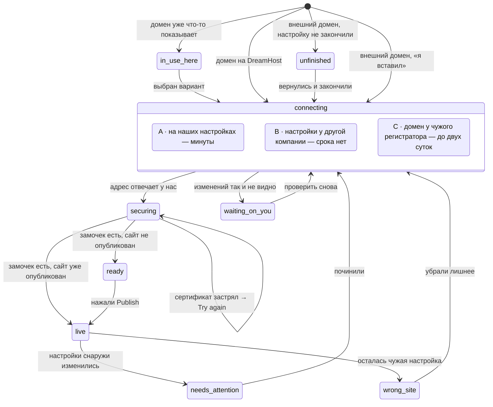

# Домены — стейт-машина подключения

> **Спасено из ветки** `origin/claude/connect-domain-flow-research-z2vuky` (коммит
> `d926e60`, 25.08.2026), исходный путь `docs/features/domains/STATES.md`.
> Дополнено тремя состояниями пути покупки из ветки
> `origin/claude/remixer-connect-domain-awdg3f` (коммит `d3d0290`, 19.08.2026),
> исходный путь `docs/Remixer Connect domain/boards/flows-end-to-end.md` — эти вставки
> помечены явно.
> **Ни одна ветка не влита.** Документ перенесён 13.09.2026 и **не перепроверялся по
> живым источникам** — ни по Figma, ни по документации DreamHost, ни по конкурентам, ни
> по коду прототипа нашей ветки, — кроме мест, где ниже прямо сказано обратное.
>
> **Назначение:** имена состояний подключения, дословный EN-копирайт каждого, один глагол
> на состояние, честный срок и выходы (включая сбойные). Это тот дизайн-дэлаверабл,
> которого у фичи нет: счастливый путь нарисован, большинство сбойных состояний — нет.
> **Каталог сбоев — `failures.md` рядом. Словарь глаголов и запреты — `copy.md` рядом.
> Экраны и геометрия — `README.md`. Факты и цены — `docs/knowledge/product-facts.md`.**

---

## 0. Что изменено при переносе — область итерации 1

**Наша итерация 1 — ровно два пути:** подключить домен, который уже лежит в аккаунте
DreamHost, и купить новый. Всё, что требует изменения у другой компании, остаётся в
документе целиком, но помечено `— итерация 2, не реализуем сейчас` и не попадает в
очередь на отрисовку.

Исходный документ этого разделения не знал: он писался под все пять значений оси
`inventory` сразу. Ничего не удалено — помечено.

⚠️ **Одна граница проходит не там, где кажется.** `connecting · B managed-elsewhere` —
это домен, **зарегистрированный у нас**, чьи настройки живут у другой компании
(канонический случай — Cloudflare). Формально он «в аккаунте DreamHost», то есть
попадает в список итерации 1, а механика у него внешняя: то, что мы напишем у себя, не
подействует. **Либо мы рисуем это состояние в итерации 1, либо доменный список обязан
такие домены отфильтровать** — иначе пользователь итерации 1 попадёт в состояние,
которого мы не построили, и будет ждать вечно. Это решение дизайнера и инженерии, и оно
не принято.

⚠️ **Дословный EN-копирайт — и есть дэлаверабл.** Строки ниже перенесены символ в символ.
Любая правка формулировки — это продуктовое решение, а не редактура: строки цитируются в
Figma и в коде, и второй экземпляр той же фразы расходится с первым в течение месяца.

---

## 1. Стандарт, по которому это сделано

Лучшие в категории имена состояний говорят, **что делать дальше**. Худшие говорят,
**что думает сервер**.

- **Эталон — Lovable, восемь состояний, глагол на каждом.** Три их находки, которые мы
  забираем целиком: `Unable to verify` — это *спроектированный таймаут в один час*, а не
  ошибка (бесконечное ожидание превращается в точку решения); `Ready` — корректно
  настроенный домен на неопубликованном проекте показывает «готово», а не «сломано»;
  `Retry` на этапе сертификата, потому что альтернатива — «удалите и добавьте заново» —
  сбрасывает всё и является худшим советом в категории.
- **Анти-эталон — Vercel `Invalid Configuration` и Netlify `Awaiting External DNS`.**
  Оба называют мнение машины. Оба породили многолетние ветки на форумах вида
  *"Domain Showing 'Invalid Configuration' Despite Correct Setup"*.
- **Слишком грубо — Bolt: `Secure` / `Pending` / `Warning`.** Под `Warning` попадает всё
  от лишней записи до мёртвого сертификата, то есть не попадает ничего.

Правила, которые из этого следуют и которые нельзя нарушать:

1. **У каждого состояния — ровно один глагол.** Исключение одно: `securing` — у него нет
   глагола, **действующего на домен** («от вас ничего не требуется» — это тоже сообщение).
   Запрещены `Try again` и `Fix` (они утверждают, что ожидание можно сократить руками);
   сама кнопка не запрещена — разрешены жесты, которые на домен не действуют
   (`Refresh status`, `Keep editing`).
2. **Вина — на ситуации, никогда на человеке.** У Lovable честная оговорка: на
   регистраторах с долгим распространением один проход через таймаут — нормальный исход
   *правильной* настройки. Значит формулировка «мы пока не видим изменений», а не «вы
   что-то сделали не так».
3. **Ни одного технического слова в пользовательских строках.** Нет `DNS`, `nameserver`,
   `A record`, `CNAME`, `301`, `SSL certificate`, `propagation`, `verification record`.
   Единственный санкционированный технический токен во всём флоу — `(SSL)` в каноническом
   чеклисте успеха, и он под вопросом. Отдельное разрешение: **чужой интерфейс можно
   называть по тому, как он выглядит** — «the orange cloud next to {domain}» законно,
   «disable the Cloudflare proxy» нет.
4. **Состояние всегда говорит, что сайт цел.** У человека сломался адрес, а не работа.
   Строка «ваш сайт по-прежнему здесь: {staging}» стоит дорого и ничего не стоит.
5. **Никогда «удалите и добавьте заново».** Это сброс всего прогресса.
6. **Ни одного срока без источника.** Строка, обещающая время, стоит на проверенном
   факте; срок, которого в фактах нет, в строку не идёт. Это не гигиена, а разбор уже
   случившегося сбоя: одна строка `Usually a few minutes` стояла на всех путях
   подключения, включая тот, по которому документация DreamHost обещает окно, измеряемое
   сутками. Отдельно: **время, которое человек тратит сам** («about five minutes» на
   вставку двух строк) — это не срок ожидания и источника не требует; путать их в одной
   карточке нельзя.

**Плейсхолдеры.** `{domain}` — адрес · `{registrar}` — где домен зарегистрирован (данные
уровня реестра, RDAP; для ccTLD, где регистратора не видно, деградируем до
`another provider`) · `{provider}` — **компания, чьи настройки домен слушает сейчас**
(канонический случай — Cloudflare; это **не** обязательно `{registrar}`, и путать их
нельзя: домен, зарегистрированный в GoDaddy и переставленный куда-то ещё, определится не
как GoDaddy) · `{staging}` — бесплатный адрес превью · `{date}` — дата · `{N}` — число
дней.

---

## 2. Карта машины

**Три вещи в этой карте стоят там, где раньше стояли неверно.**

1. **`connecting` — составное состояние из трёх вариантов, а не одно.** Топология у них
   общая, копирайт и обещанный срок — нет.
2. **Застрявший сертификат остаётся внутри `securing`** (петля на себя, глагол
   `Try again`), а не уезжает в `needs-attention`: `needs-attention` — это «работало и
   перестало», а здесь ещё ничего не начинало работать.
3. **У `live` два входа.** `ready → live` — это нажатый Publish. Но если сайт уже
   опубликован, а домен подключают к нему потом, то `securing → live`: замочек — это
   последнее, что должно случиться, и в этом случае после него `ready` не наступает
   никогда.

`waiting-on-you` достижимо только из вариантов B и C: в варианте A ждать нечего, потому
что изменение применяем мы сами.

---

## 3. Достижимость по сценариям — и что из этого в итерации 1

Половина состояний недостижима для домена, который лежит в аккаунте DreamHost, — и это
ровно то, что делает наш сценарий «своё» сильным.

| Состояние | `dh-free` | `dh-in-use` | `dh-external-ns` | `external-dc` | `external-manual` | Итерация |
|---|---|---|---|---|---|---|
| `in-use-here` | — | **да, всегда** | — | — | — | **1** (базовый случай) |
| `connecting · A in-account` | да (секунды) | да | — | — | — | **1** |
| `connecting · B managed-elsewhere` | — | — | **да, всегда** | — | — | ⚠️ граница — см. §0 |
| `connecting · C at-another-company` | — | — | — | да | да | 2, не реализуем сейчас |
| `unfinished` | — | — | да | да | **да, часто** | 2, не реализуем сейчас |
| `waiting-on-you` | — | — | да | да | **да, часто** | 2 (кроме варианта B) |
| `securing` | да | да | да | да | да | **1** |
| `ready` | **да, часто** | да | да | да | да | **1** |
| `live` | да | да | да | да | да | **1** |
| `needs-attention` | редко | редко | да | да | да | **1**, редко |
| `wrong-site` | — | да | да | да | да | **1**, редко |
| `elsewhere-in-dreamhost` | — | — | — | — | — | **1** (вход в поиске), копирайта нет |
| `registering` · `propagating` (покупка) | — | — | — | — | — | **1** — см. §5 |

---

# 4. Состояния

## `connecting` — одно состояние, три варианта копирайта

**Когда возникает.** Человек нажал `Connect` (домен на DreamHost) или «я вставил обе
строки» (внешний домен). Дальше начинается ожидание — и вот его-то нельзя описывать одной
строкой.

**Почему вариантов три.** Строка `Usually a few minutes` стояла на всех путях
подключения, и на двух из трёх она неправда. Различает варианты не тон, а механика:
когда домен управляется DreamHost, записи пишем мы сами, и внешнего изменения нет вообще;
распространение зависит от типа изменения, а не от нашей скорости (наш собственный срок
жизни записи — 5 минут — против кэшей провайдеров); смена того, куда указывает домен, у
другой компании документирована как 4–72 часа; домен может быть нашим, а слушать не нас.
**Право на фразу `a few minutes` есть ровно у одного варианта из трёх.**

**Общее для всех трёх.** Пульсирующая амбер-точка рядом с адресом, чеклист успеха с
первым пунктом в работе, кнопка обновления и явное разрешение уйти. Никаких блокировок:
панель можно закрыть и редактировать сайт дальше. И ни один из трёх **не обещает письма**
— уведомление не подтверждено; честная пара — «it goes live on its own» + `Refresh status`.

---

### A · `connecting · in-account` — домен в аккаунте DreamHost, на наших настройках

**Итерация 1.** Оси прототипа: `inventory: 'dh-free' | 'dh-in-use'`.

**Когда возникает.** Нажат `Connect` на домене из списка «Existing domains».

**Что происходит на самом деле.** Изменение применяем мы сами, у себя, и собственный срок
жизни записи у нас — минуты. Снаружи менять нечего, ждать нечего, состояние промелькнёт.
**Это единственный вариант, которому разрешено произносить `a few minutes`, и он это
право заработал.**

**Что видит.** Амбер-точка у адреса, первый пункт чеклиста в работе, разрешение уйти.

**EN copy**
> **Connecting {domain}**
> Usually a few minutes. Keep editing — it goes live on its own.

**Глагол.** `Refresh status` · вторая кнопка `Keep editing`

**Срок.** Минуты (наш собственный срок жизни записи — 5 минут). Секунды в лучшем случае.

**Выходы.** → `securing` (адрес отвечает у нас) · сбоев у этого варианта практически нет,
`waiting-on-you` отсюда недостижим.

**Откуда.** Lovable `Verifying` с действием *Check status*; разрешение уйти — из
publish-флоу Lovable, где копирайт прямо отпускает пользователя.

**В Figma.** Да.

---

### B · `connecting · managed-elsewhere` — домен наш, но его настройки живут у другой компании

⚠️ **Граничный случай итерации 1 — см. §0.** Оси прототипа: `inventory: 'dh-external-ns'`
(канонический случай — Cloudflare).

**Когда возникает.** Нажат `Connect` на домене, который зарегистрирован у нас, а отвечает
за него другая компания.

**Что происходит на самом деле.** **То, что мы напишем у себя, просто не подействует.**
Это не ожидание, а передача хода: пока не переключат там, не произойдёт ничего и никогда.
Значит этому варианту нельзя обещать не «пару минут», а **вообще никакой срок**.

**Что видит.** Не спиннер. Экран, который говорит: наша половина готова, осталась одна
перемена у названной компании — и сразу ведёт к ней. Тон — «вот где сейчас живут
настройки», а не «вы что-то сделали не так».

**EN copy**
> **One change left, over at {provider}**
> {domain} is set up on our side. It goes live as soon as {provider} starts sending visitors here.

Строка после того, как человек сказал, что переключил:
> Changes at {provider} can take up to six hours to reach everyone. Keep editing — we'll keep checking.

**Глагол.** `Show me what to change at {provider}` · вторая кнопка `Refresh status`

**Срок.** До перемены — **никакого срока вообще**, это принципиально. После перемены — до
шести часов у чужих кэшей (наш собственный срок жизни записи — минуты).

**Выходы.** → `waiting-on-you` (переключили, но мы не видим) · → `securing` (увидели) ·
остаётся здесь бесконечно, если у `{provider}` ничего не меняют.

**Откуда.** Прямая ссылка в настройки названной компании — бесплатная половина Entri. Для
Cloudflare сюда же приезжает оговорка про проксирующий режим — она написана в
`waiting-on-you`.

**В Figma.** Нет.

---

### C · `connecting · at-another-company` — домен у чужого регистратора

**— итерация 2, не реализуем сейчас.** Оси прототипа:
`inventory: 'external-dc' | 'external-manual'`.

**Когда возникает.** Человек сказал «я вставил обе строки» на внешнем домене.

**Что происходит на самом деле.** Человек меняет у другой компании то, куда указывает его
домен. Документация DreamHost даёт по этой операции окно, измеряемое сутками; наша
собственная скорость здесь ни при чём, потому что ждём мы чужие кэши.

**Что видит.** То же, что в варианте A, но с честным окном и без слова «минуты». Уйти
можно так же — и именно здесь это важнее всего, потому что ждать придётся дольше всего.

**EN copy**
> **Connecting {domain}**
> Usually under an hour, sometimes up to two days. Keep editing — it goes live on its own.

**Глагол.** `Refresh status` · вторая кнопка `Keep editing`

**Срок.** Документация DreamHost: 4–72 часа. Поле (Replit, Shopify) говорит «up to
48 hours».

⚠️ **Расхождение внутри самой цифры — решать дизайнеру.** Правила копирайта остановились
на `up to two days` (по полю), а наша собственная документация обещает окно на сутки
длиннее. Пока это не закрыто, `two days` — обещание, которого наш худший случай не
выполняет. Два выхода: сказать `up to three days` (честно, но мы одни в поле такие) или
оставить формулировку поля и объяснить почему. Рекомендация исходного документа —
`up to three days`: цитировать чужой SLA поверх своей документации — ровно та ошибка, из-за
которой этот раздел переписан.

**Выходы.** → `waiting-on-you` (через ~час) · → `securing` · → `unfinished` (ушёл, не
закончив).

**В Figma.** Да (счастливый путь).

---

**Общее для всех трёх и легко теряемое: замочек — это ЧЕТВЁРТОЕ ожидание, а не шаг внутри
этих.** Сертификат нельзя выпустить, пока адрес не начал отвечать у нас, поэтому
`securing` начинается только там, где кончилось `connecting`, — и на варианте C он стоит в
очереди за сутками, а не за получасом. В интерфейсе это несёт третий пункт чеклиста: он не
тикает вместе со вторым.

---

## `waiting-on-you`

**— итерация 2, не реализуем сейчас** (кроме прихода из варианта B, см. §0).

**Когда возникает.** Прошёл примерно час, а изменений у регистратора мы так и не видим.
Это **спроектированный таймаут**, а не ошибка: дальше человек, скорее всего, смотрит не на
медленные записи, а на неправильные.

**Что видит.** Не ошибку. Экран, который показывает **сравнение**: что стоит у
регистратора сейчас и что там должно стоять, с кнопкой «скопировать» на правильном
значении, и инструкцию именно для его регистратора со ссылкой прямо в нужный раздел.
Тон — «мы пока не видим», а не «вы ошиблись».

**EN copy**
> **We can't see the change at {registrar} yet**
> It usually shows up within an hour. Here's what we're looking for — and what we found instead.

Блок сравнения (заголовки колонок): `What's there now` · `What it should be`
Подпись под несовпавшей строкой: `One character is off — copy it again and paste over what's there.`
Подпись под лишней строкой: `This one is left over from your old site. Remove it.`

Вариант для Cloudflare:
> In Cloudflare, click the orange cloud next to {domain} so it turns grey, then check again.

Вариант «прошло два дня»:
> **We still can't see the change at {registrar}**
> Two days is inside what this can take, so nothing is broken — but let's try the other way instead of waiting longer. It takes about five minutes and we'll walk you through it.

**Глагол.** `Show me what to paste` · вторая кнопка `Check again` · ссылкой
`Open your settings at {registrar} ↗` · в 48-часовом варианте `Try the other way`

**Срок.** Вход — ~1 час. Строка обещает «within an hour». `about five minutes` в
48-часовом варианте — это **время работы человека**, не срок ожидания.

**Выходы.** → `connecting` (`Check again`) · остаётся здесь · → 48-часовой вариант.

**Откуда.** Таймаут в час — Lovable `Unable to verify`, переименованный так, чтобы винить
ситуацию. Вариант Cloudflare — пока включён проксирующий режим, проверка не пройдёт
никогда, и назвать это надо тем, как это выглядит на экране, а не механизмом.
**48-часовой вариант смягчён осознанно:** заголовок «Two days is longer than this should
take» противоречил нашему же факту — двое суток лежат ВНУТРИ задокументированного окна, то
есть строка называла нормальный исход поломкой.
**Сравнение вместо таблицы записей — наше:** ни один конкурент этого не делает, а оно
превращает невидимые сбои класса «то, что есть ≠ то, что нужно» в один видимый — это
строки 1, 2, 3 и 4 каталога в `failures.md`.

**В Figma.** Нет. Один из трёх фреймов, которые надо рисовать первыми — **в итерации 2**.

---

## `unfinished`

**— итерация 2, не реализуем сейчас.**

**Когда возникает.** Настройку внешнего домена начали и не закончили: экран с двумя
строками открывали, но у регистратора ничего не менялось и человек ушёл. Домен остаётся в
списке.

**Что видит.** Строку в списке доменов, помеченную как незавершённую, и карточку, которая
возвращает ровно туда, где он остановился. Плюс честный срок, если он у нас есть.

**EN copy**
> **Finish connecting {domain}**
> You started this on {date} and nothing has changed at {registrar} yet. Pick up where you left off — it takes about five minutes.

Строка срока (значение — открытый вопрос):
> We'll keep your setup here for {N} more days.

**Глагол.** `Finish setup` · вторая кнопка `Remove`

**Срок.** `{N}` дней хранения — **значение не решено**. `about five minutes` — время
работы человека.

**Выходы.** → `connecting` (`Finish setup`) · → удалено (`Remove`) · → молчаливое
отвязывание по истечении `{N}`.

**Откуда.** Squarespace молча отвязывает домен, если подтверждение так и не появилось —
срок у них назван в документации, но **в интерфейсе это молчаливый убийца**. Состояние
делает срок видимым.

**В Figma.** Нет.

---

## `securing`

**Итерация 1** — на обоих путях.

**Когда возникает.** Адрес уже отвечает у нас, владение подтверждено — выпускается
сертификат (в интерфейсе — «замочек»). **Раньше этого момента состояние возникнуть не
может, и это не деталь реализации, а порядок:** сертификат нельзя выпустить, пока домен не
указывает на DreamHost. Отсюда и фиксированный порядок пунктов в чеклисте, и петля на себя
в карте вместо перехода в `needs-attention`.

**Что видит.** Продолжение того же экрана: второй пункт чеклиста закрыт, третий в работе.
**Действия над доменом нет** — и это сообщение: от человека ничего не требуется.

**EN copy**
> **Almost there — turning on the padlock**
> Nothing for you to do. This usually takes ten to thirty minutes, sometimes a little longer.

Вариант «застряло»:
> **This is taking longer than it should**
> Your setup is fine — we just need to try the padlock again. Nothing you did will be lost.

**Глагол.** Нет — ни одного, который действует на домен. В варианте «застряло» глагол
появляется, и это не исключение из правила, а другое состояние: там действие действительно
есть — `Try again` (и **никогда** «удалите и добавьте заново»).

**Срок.** 10–30 минут (Let's Encrypt в панели DreamHost), «sometimes a little longer».
⚠️ **Число честно ровно наполовину:** это время установки сертификата в панели DreamHost, а
не замер публикации Remixer. Открытый пункт с названным владельцем: «время один настоящий
publish и запиши дату».
⚠️ **Порядок важнее числа.** На варианте C замочек стоит в очереди за сутками, а не за
получасом: `ten to thirty minutes` — срок самого выпуска, и он начинает тикать только
после того, как адрес начал отвечать. Формулировка «within half an hour of connecting»
(она встречается в старых правилах копирайта) читается как «полчаса от нажатия» и на
внешнем пути неверна.

**Выходы.** → `ready` (замочек есть, сайт не опубликован) · → `live` (замочек есть, сайт
уже опубликован) · петля на себя, вариант «застряло» → `Try again`.

**Откуда.** Lovable `Setting up` — дословно *"nothing for you to do"*; их же
`Stalled`/`Failed` с *Retry* и прямым предупреждением, что удалять и добавлять заново не
надо.

**В Figma.** Частично: базовый вариант нарисован, «застряло» — нет.

⚠️ **Точная формулировка правила «кнопки нет».** Пока замочек **выпускается нормально**, у
состояния нет глагола, действующего на домен. Запрещены `Try again` и `Fix` — они
утверждают, что ожидание можно сократить руками, чего человек сделать не может. Разрешены
жесты, которые на домен не действуют: `Refresh status` спрашивает, приехал ли замочек,
`Keep editing` закрывает поверхность. Строка «от вас ничего не требуется» остаётся правдой
про домен — она и есть смысл состояния. В варианте «застряло» запрет снимается сам.

---

## `ready`

**Итерация 1. Вероятно, самое частое состояние у новичка во всём флоу.**

**Когда возникает.** Адрес настроен и работает, **но проект ещё не опубликован**.

**Что видит.** Не ошибку и не спиннер. Спокойное «всё готово, остался один шаг»: синяя
кнопка `Publish` и тихий выход «можно редактировать дальше». **О цене публикации экран не
говорит ничего.**

**EN copy**
> **{domain} is ready — publish to put your site on it**
> Your address is set up. Visitors will see your site the moment you publish.

**Глагол.** `Publish` (основное действие, синее) · второй строкой `Keep editing`

**Срок.** Бесконечно — состояние ждёт человека, а не систему. Это и есть его проблема.

**Выходы.** → `live` (нажали Publish). Иначе — остаётся здесь навсегда, и человек делает
вывод, что продукт сломан.

⚠️ **Фразы «Publishing is free» здесь нет и по дизайн-аргументу она не возвращается.**
Публикация сегодня кредиты тратит (verified), а нулевая цена публикации — это наша
**позиция**, а не поведение продукта. **Условие возврата — изменившийся факт, а не довод.**
Подставить вместо неё кредитную цену тоже нельзя — verified цифры нет, и число здесь было
бы той же ошибкой в обратную сторону.

**Откуда.** Lovable `Ready`. У нас риск выше, чем у Lovable: они вообще не дают подключить
домен до первой публикации (*"Publish your project before connecting a custom domain"*), а
наш Launchpad предлагает домен сразу — значит попасть сюда легче.

**В Figma.** Нет. **Первый фрейм в очереди.**

---

## `live`

**Итерация 1.**

**Когда возникает.** Домен работает, сайт опубликован, замочек есть.

**Что видит.** Зелёная точка, адрес, закрытый чеклист успеха в **фиксированном порядке** и
приглашение поделиться — успех должен толкать к распространению, а не просто подтверждать.

**EN copy**
> **Your site is live at {domain}**
> Secure padlock on · anyone can visit. Share it to get your first visitors.

Канонический чеклист (порядок не меняется никогда):
> `Domain settings updated` · `Connected to your site` · `Security (SSL) on`

**Глагол.** `Visit site ↗` · рядом `Copy link`

**Срок.** Терминальное состояние.

**Выходы.** → `needs-attention` (настройки снаружи изменились) · → `wrong-site` (осталась
чужая настройка).

⚠️ Третий пункт чеклиста закрывается **позже** второго, а не вместе с ним: между ними
стоит целое состояние (`securing`).

**Откуда.** Lovable state 3: *"Your website is live"* / *"Share it to get your first
visitors."* — их успех продаёт распространение, и это лучший копирайт в категории. Наше
собственное решение: в самом ценном слоте панели стоит живая кнопка, а не мёртвая
задизейбленная (у Lovable там `Publish changes` в disabled — слот потрачен зря).

⚠️ **Вопрос дизайнеру, не закрытый в исходной ветке:** какое действие главное на успехе —
`Visit site ↗` (как в карточке) или `Back to editing` (как было собрано в прототипе той
ветки)?

**В Figma.** Да.

---

## `needs-attention`

**Итерация 1, редко** (для домена в нашем аккаунте это значит «кто-то увёл nameservers
наружу»).

**Когда возникает.** Работало и перестало: настройки у регистратора изменились, домен
переставили на другие серверы имён, регистратор «помог» и сбросил что-то сам.

**Что видит.** Амбер (единственное место наряду со stale-точкой публикации, где вообще
используется амбер), дату, когда сломалось, и — обязательно — что сайт цел и по-прежнему
доступен на бесплатном адресе.

**EN copy**
> **{domain} stopped showing your site**
> Something changed at {registrar} on {date}. Your site is safe — it's still at {staging}.

**Глагол.** `Fix this` (ведёт в сравнение из `waiting-on-you`)

**Срок.** Нет — до починки.

**Выходы.** → `connecting` (починили).
⚠️ **`Fix this` ведёт в `connecting`, а не в сравнение**, пока экрана `waiting-on-you` нет.
Это названное упрощение.

**Откуда.** Lovable `Offline`. Эмоциональная половина — наша: сбой долгохвостый, но
переживается тяжело, и первая мысль человека «я потерял сайт» должна быть снята в первой же
строке.

**В Figma.** Нет.

---

## `wrong-site`

**Итерация 1, редко** (достижимо на `dh-in-use`).

**Когда возникает.** По адресу открывается не тот сайт — у части посетителей или у всех.
Причина почти всегда одна: у регистратора осталась настройка от прежнего хостера.

**Что видит.** Прямую формулировку проблемы глазами посетителя, а не описание записи.

**EN copy**
> **{domain} is showing a different site**
> An older setting at {registrar} is still sending some visitors somewhere else. Remove it and your site takes over.

**Глагол.** `Point it here`

**Срок.** Нет — до починки.

**Выходы.** → `connecting` (убрали лишнее).

**Откуда.** У Lovable это отдельная страница помощи «my domain shows the wrong site».
Причины — сбои 3 и 4 каталога (остатки от прежнего хостера, забытая IPv6-запись); для
новичка они **невидимы**, поэтому это состояние — единственный способ, которым он о них
вообще узнает. Имя изменено: раньше состояние называлось `taken-over`, что читается как
захват домена, то есть как инцидент безопасности.

**В Figma.** Нет.

---

## `in-use-here` — коллизия внутри аккаунта

**Итерация 1. Для нас это базовый случай, а не пограничный.**

**Когда возникает.** Домен, который человек выбрал, уже что-то показывает: WordPress,
парковку, старый сайт билдера. Домены наших пользователей лежат в аккаунте DreamHost,
который очень вероятно уже что-то обслуживает. У конкурентов это край, потому что они не
регистраторы для домена, купленного три года назад.

**Что видит.** Один экран, два названных варианта, у каждого — последствие своими словами,
и ни одного одиночного «вы уверены?». Скрим накрывает всё, домен приколот сверху.

**EN copy**
> **{domain} already shows a website**
> Choose what visitors see. Nothing is deleted either way.

**Вариант A — основной**
> **Show this new site at {domain}**
> Your old site stays in your account, and you can switch back any time.
> `Use this site`

**Вариант B**
> **Keep the old site at {domain}**
> Your new site gets a different address, and visitors to {domain} keep seeing the old site.
> `Keep the old one`

Третьей строкой — `Cancel`.

**Глагол.** Два названных варианта, каждый со своей кнопкой. Никакого одиночного
«вы уверены?».

**Срок.** Нет — это развилка, а не ожидание.

**Выходы.** → `connecting` (выбран вариант A) · закрытие (вариант B) · `Cancel`.

⚠️ **Открытое место варианта B:** какой именно адрес получает новый сайт. Ресёрч предлагает
`www.{domain}`, но для новичка «сайт живёт на www, а на основном адресе старый» —
конструкция, которую трудно удержать в голове. Возможные ответы: остаться на бесплатном
`{staging}`, предложить поддомен, или вообще убрать вариант B и оставить «отмена».
**До ответа рисуем вариант A плюс `Cancel`** — он честен и не обещает того, чего мы не
спроектировали.

**Как это решают в поле**

| Продукт | Что говорит | Чем кончается |
|---|---|---|
| **Wix** | Внутри аккаунта: «Assign to a Different Site» с двумя явными вариантами — *"Redirect it to the primary domain"* / *"Replace the current primary domain"*. Между аккаунтами: *"This domain is associated with another Wix account…"* | **Самообслуживание, лучшее в категории: назван результат каждого варианта** |
| **Squarespace** | *"This domain is already connected to another Squarespace site"* | Самообслуживание: отключить и подключить; для своих доменов есть «Move domain» |
| **Shopify** | *"This domain is already connected to another Shopify store."* | **Поддержка с доказательством владения** — задокументированная многолетняя боль |
| **Lovable / Vercel** | *"domain already exists under a different context"* | **Тупик:** пользователь даже не видит, какой проект держит домен |

**Чего не делаем никогда.** Не отправляем в поддержку с доказательством владения (Shopify).
Не говорим «домен занят другим контекстом» (Vercel). Не показываем один страшный confirm
там, где есть выбор.

**Тон гарда, который уже правильный** (не переписывать, только развернуть в два варианта):
*"Connecting will replace what visitors see at {domain}. Your files stay safe and you can
switch back."* — здесь есть и последствие, и обратимость.

**В Figma.** Частично: гард с правильным тоном есть, но с одним вариантом.

---

## `elsewhere-in-dreamhost` — домен в другом аккаунте DreamHost

**Итерация 1 по достижимости, но копирайта нет.**

**Когда возникает.** Домен есть, он у DreamHost, но принадлежит другому аккаунту (жена,
бывший подрядчик, старая регистрация на другой email).

**Состояние названо, копирайт не принят** — потому что мы не знаем механизма (нужна
политика: пускаем ли по подтверждению владения, зовём ли поддержку, есть ли
самообслуживание).

Каркас, от которого отталкиваться:
> **{domain} is in a different DreamHost account**
> …

**Глагол.** Не определён — зависит от политики.

**Выходы.** Не определены.

**Откуда.** Wix для кросс-аккаунтного случая говорит прямо: *"This domain is associated
with another Wix account. To connect your domain, you need to remove it from the other
account."* Shopify упирается в поддержку с доказательством владения — многолетняя боль
сообщества, повторять нельзя. У Vercel/Lovable это тупик, где пользователь даже не видит,
какой проект держит домен.

---

# 5. Путь покупки — три состояния, которых в исходной машине нет

> **Вставка из ветки** `origin/claude/remixer-connect-domain-awdg3f` (19.08.2026),
> `docs/Remixer Connect domain/boards/flows-end-to-end.md` §1–§4. Не перепроверялось.

Исходная стейт-машина описывает **подключение**, и молча считает, что купленный домен
ведёт себя как домен в аккаунте. **Это неверно, и разница — скорость.**

- **Уже в аккаунте** — nameservers наши и давно распространились. Направление домена на
  сайт меняет *записи в нашей же зоне*, а не nameservers. Эффект почти мгновенный.
  «Connects in a few seconds» тут честно.
- **Только что зарегистрирован** — домен нов для глобального DNS, и его nameservers
  обновляются **24–72 часа**. Это **не** секунды.

> **Flow A (свой домен) может быть одним непрерывным моментом. Flow B (новая покупка)
> обязан пережить закрытие вкладки, потому что легитимно занимает часы и сутки.**

❌ Этим сломана строка, которая **уже нарисована**: hi-fi борд `28206:66756`, состояние
`1 connecting`, аннотирован «домен куплен у DreamHost, DNS наш, счёт секундам». Для
**только что зарегистрированного** домена это неверно по проверенному факту. Строка
чек-аут-шита *"Connects automatically after checkout"* не ошибочна, но молчит о
длительности, и новичок прочитает её как «сразу».

### `registering` — регистрация в реестре

**Итерация 1.** **Когда возникает.** Оформлен заказ, реестр ещё не отдал домен.
**Срок.** «within 15 minutes of completing the purchase form» (verified).
**Что видит.** Строка в панели, топбар **по-прежнему показывает стейджинг** — домен
действительно ещё не работает, и **поле адреса не имеет права врать**.
**Глагол.** Нет — действия нет.
**EN copy (предложение, не принятая формулировка)**
> Registering {domain} — usually under 15 minutes.

**Выходы.** → `propagating`.

### `propagating` — домен идёт по миру

**Итерация 1.** **Когда возникает.** Домен зарегистрирован, nameservers расходятся по
кэшам.
**Срок.** Часы, не секунды; до 72 часов по всему миру.
**Что видит.** Амбер-точка и **никакой кнопки действия** — её действительно нет.
**EN copy**
> **"{domain} is on its way"**
> "Most visitors will reach your site within a few hours. It can take up to 72 hours to work everywhere in the world — that part is the internet, not us."
> *We keep checking · nothing for you to do · you can close this.*

**Выходы.** → `securing` → `live`. Плюс `failed`.
⚠️ **Состояние обязано быть возобновляемым:** человек уйдёт и вернётся, возможно назавтра,
и флоу должен стоять ровно там, где его оставили. **Стейджинг работает всё это время** — и
это та самая опора, которая делает 72-часовое ожидание переносимым.

### `icann-verify` → **`waiting-on-confirmation`** — подтверждение почты регистранта (переписано 14.09.2026)

**Итерация 1, путь покупки. БЛОКИРУЮЩЕЕ состояние, а не фоновое напоминание.**

> 🔴 **ЧТО ЗДЕСЬ ФАКТ (verified-by-first-party · 14.09.2026).** Девелопер DreamHost
> (Дмитро Кондратенко, Slack), отвечая на прямой вопрос дизайнера:
> **пока почта регистранта не подтверждена, домен не резолвится.** Подключить его можно
> («законектити можна начебто»), опубликовать на него можно («палішити мабуть теж можна») —
> **ссылка не работает** («вебсайт поідеї не буде працювати якщо запаблішити»; «то есть
> запаблишить можно, но без подтверждения почты работать линка не будет?» — «так»).
> Факт целиком — `docs/knowledge/product-facts.md` п. 29.

**Что было написано здесь до поправки — оставлено, не удалено:**

> ~~**Когда возникает.** ICANN 2013 RAA требует подтвердить email регистранта после
> новой регистрации или смены контакта. Не подтвердили — **домен приостанавливают**:
> падает и сайт, и почта. Это самое разрушительное неучтённое состояние во всём флоу.~~
> — верно про 16-й день и **неверно про всё, что до него**: сайта, который «падает»,
> на этом домене никогда не было. Состояние не «редкое и катастрофическое», а
> **обязательное для каждого, кто покупает у нас домен впервые**.

---

#### Установленный факт — три строки, на которых стоит всё остальное

| # | Факт | Статус |
|---|---|---|
| Ф1 | Подключить домен с неподтверждённой почтой **можно** | verified-by-first-party · 14.09.2026 |
| Ф2 | Опубликовать на него **можно** | verified-by-first-party · 14.09.2026 |
| Ф3 | **Домен не резолвится** — ссылка не работает ни у владельца, ни у посетителя | verified-by-first-party · 14.09.2026 |

Остаётся из ресёрча 13.09.2026 (через суммаризатор, **не первопартийно**): 15 календарных
дней и письма на дни 1/5/10/15 · на 16-й день `clientHold` · верификация привязана к **EMAIL**
регистранта, а не к домену · отправитель `do-not-reply@dreamhostregistry.com` · смена адреса
регистранта запускает новый цикл и 60-дневный лок трансфера.

#### Ответ дизайна на этот факт — НАШ, не факт

**1. «`live` + неподтверждённая почта» — НЕ легальное состояние этой машины.**
`live` определён выше как «домен работает, сайт опубликован, замочек есть» и закрывает все три
строки чеклиста. Здесь ложна ровно средняя — `Connected to your site`. Значит это не «live с
оговоркой», а другое состояние: **зарегистрировано, ждём твоего подтверждения.**
Формально: у `live` теперь **два независимых предусловия** — адрес резолвится **И** почта
регистранта подтверждена.

**2. Оно стоит ПЕРЕД `propagating`/`securing`/`live`, а не рядом с ними.** Часы начинаются
в момент регистрации (письмо уходит тогда же), и пока они идут, домен не отвечает никому.
Состояние держит экран само, когда оно — единственное, что осталось.

**3. Кому оно ВООБЩЕ не показывается.** Только путь **BUY NEW** и только первая
регистрация на этот адрес почты: CONNECT OWNED — это домен, уже лежащий в аккаунте, его
почту подтвердили раньше. Состояние условное и серверное — не рисовать его как шаг
мастера, который проходят все.

**4. Что видит клиент.** Амбер-карточка в панели Publish; **поле адреса держит
стейджинговый `*.remixer.ai`**, зелёной пилюли `Live` нет нигде — ни в панели, ни в чипе
топбара (решение дизайнера, `decisions.md` 14.09.2026). Зелёный в этом продукте значит
**all clear**, а здесь ссылка не откроется.

**5. Публикацию не блокируем** — и это прямое следствие Ф2. Человек публикует, сайт
работает на стейджинге, и единственное, чего нет, — купленное имя. Запретить публикацию
значило бы держать сайт запертым из-за события, которое происходит в чужой почте.

**6. Срок.** До клика клиента — бесконечно (точнее, до 16-го дня, когда домен забирают
совсем). После клика — не мгновенно: домен, который ни разу не резолвился, до четырёх
часов сидит в негативном кэше (`SOA MINIMUM` 14400, `likely`) — значит после подтверждения
идёт обычный `connecting`/`propagating`, а не прыжок в `live`.

**Глагол.** `Resend` — единственное, что мы умеем сделать со своей стороны.
⚠️ Кнопка нарисована на борде `28206:66756`, но **ничем не подтверждена** в документации
DreamHost (`product-facts.md` п. 26) — решение продукта и инженерии, а не дизайн-допущение.
Настоящее действие живёт **вне продукта** — в почте клиента, и это единственное состояние
флоу с таким выходом.

**EN copy (предложение, не принятая формулировка — дизайнер её не утверждал)**
> **Confirm your email to switch on {domain}**
> We sent a link to {email}. Until you click it, **{domain} won't open for anyone** — your
> site is live at {staging} in the meantime.
> *Check for do-not-reply@dreamhostregistry.com · confirm before the deadline in the email.*

⚠️ **Три запрета на этот экран.** (а) Никакого обратного отсчёта «14 days left» — число
подтверждено только через суммаризатор (15, не 14), и срок всё равно не главное —
главное, что домен **не работает СЕЙЧАС**. (б) Никакого зелёного и слова `Live`.
(в) Никакого «we'll keep checking» — мы не проверяем, мы ждём действия человека; формула
«от вас ничего не требуется» здесь — прямая ложь.

**Выходы.** подтвердил → `connecting`/`propagating` → `securing` → `ready`/`live` ·
не подтвердил до 16-го дня → приостановка (`clientHold`), выход из неё уже через reCAPTCHA
на припаркованной странице и +24–48 ч — **отдельное состояние `suspended`, у нас не нарисовано и
не написано**.

**Нарисовано** на борде `28206:66756` как `5 icann verify`: «We sent a link to
roman@example.com · 14 days left» + `Resend`. ⚠️ Борд нарисован **до** этого факта и не
говорит главного — что домен не работает. Поднято дизайнеру.

⚠️ **Правило реальное, число — нет** (сохранено из прежней редакции, частично закрыто):
«15 дней» в первом ресёрче прослеживалось до правила отвязки **Squarespace**; 13.09.2026 число
прослежено до страницы DreamHost, но **через суммаризатор** (`product-facts.md` п. 26).
Цифру на экран по-прежнему не ставим: копирайт говорит «before the deadline in the
email».

⚠️ **Что здесь ОТКРЫТО** (вопросы инженерии, не выдумывать ответы):
1. **Механизм**: `clientHold` с первого дня, невыставленная делегация или третье. От этого
   зависит, что видит посетитель — ошибка браузера или чужая заглушка.
2. **Может ли вообще выпуститься сертификат** на нерезолвящийся домен. По §`securing`
   — нет («сертификат нельзя выпустить, пока домен не указывает на DreamHost»), и тогда пара
   «замок выпускается + почта не подтверждена» недостижима — а значит правило 13.09.2026
   «padlock старше ICANN, когда истинны оба» решает несуществующий конфликт
   (`decisions.md`, 14.09.2026 — правило помечено как заменённое).
3. **Знает ли билдер про подтверждение по API** — или состояние придётся выводить
   косвенно. От этого зависит, сможет ли экран сам уйти после клика в почте.

---

# 6. Канонический чеклист: три пункта, четыре стадии

Три строки, и порядок в них — это и есть информация: замочек приходит последним. Значит
**стадий у чеклиста на одну больше, чем пунктов**, и пропущенная стадия — ровно та, ради
объяснения которой чеклист существует.

| Стадия | Состояние | `Domain settings updated` | `Connected to your site` | `Security (SSL) on` |
|---|---|---|---|---|
| 0 | `connecting` (любой из трёх вариантов) | в работе | — | — |
| 1 | `connecting`, изменение увидено | ✓ | в работе | — |
| 2 | **`securing`** | ✓ | ✓ | **в работе** |
| 3 | `live` | ✓ | ✓ | ✓ |

**Стадия 2 — это весь смысл чеклиста.** «Connected to your site» закрывается, когда адрес
начал отвечать; «Security (SSL) on» — когда установлен сертификат, и между этими двумя
событиями проходит собственное окно сертификата, а на варианте C перед ними обоими стоит
ещё и окно 4–72 часа. Закрыть их одним движением — значит удалить состояние, которое
чеклист и должен показывать.

**Чеклист обязан быть одним компонентом:** домов у него два — статус-экран и панель
Publish; копирайт, отправленный дважды, разъезжается дважды.

---

# 7. Что рисовать в первую очередь

Очередь исходного документа, пересортированная под нашу итерацию 1. Реализация без фрейма —
это прочтение, а не дизайн.

**Нулевой приоритет — не фрейм, а строка.** Разделить `connecting` на варианты в уже
существующих экранах (статус-экран **и** панель Publish). Это дешевле любого фрейма ниже, а
исправляет обещание, которое продукт не выполняет.

| Приоритет | Фрейм | Итерация | Почему именно он |
|---|---|---|---|
| 1 | `ready` | **1** | Самое частое состояние у новичка. Подключил домен, не нажал Publish, решил, что сломалось |
| 2 | `in-use-here` с двумя вариантами | **1** | Наш базовый случай. В Figma гард по-прежнему с одним вариантом |
| 3 | `registering` + `propagating` (путь покупки) | **1** | Единственное честное объяснение 24–72 часов; без него чек-аут обещает «сразу» |
| 4 | `securing` как **отдельный** экран (стадия 2 чеклиста) | **1** | Своего фрейма у состояния нет, «застряло» не нарисовано вовсе |
| 5 | `needs-attention` | **1**, редко | Самая высокая эмоция на единицу трафика |
| 6 | `waiting-on-you` со сравнением | 2 | Дом четырёх самых частых сбоев сразу и наш единственный настоящий отрыв в этом флоу |
| 7 | `connecting · managed-elsewhere` (вариант B) | ⚠️ граница | Единственное состояние, которое не пройдёт само **никогда** |
| 8 | `unfinished` · `wrong-site` | 2 / 1 редко | Дешёвые фреймы, спасают молча умирающие настройки |

---

# 8. Расхождения с прототипом — архивная таблица, НЕ сверена с нашим кодом

⚠️ **Читать как исторический документ.** Таблица ниже описывает прототип **ветки
z2vuky по состоянию на 20.08.2026** и ссылается на её файлы и коммиты. Наша ветка
(`claude/remixer-connect-domain-flow-4fpgqc`) с тех пор разошлась; **ни одна строка не
перепроверена по нашему коду 13.09.2026.** Ценность таблицы — в том, *какие* расхождения
между машиной и реализацией бывают, а не в том, что они есть у нас сегодня.

| # | Где | Что стояло в прототипе z2vuky | Что должно быть по машине |
|---|---|---|---|
| 1 | `PublishPanel` и `StatusScreen`, стадия 0 | обещание «пара минут» на всех путях, в двух местах и **двумя разными фразами** (`Usually a few minutes — keep editing, it goes live on its own.` на экране, `Connecting — usually a few minutes. Keep editing, it goes live on its own.` в панели) | три варианта `connecting` (A/B/C); `a few minutes` разрешено только A. Плюс одна фраза на две поверхности |
| 2 | `StatusScreen`, `securing` | было: `verifying` перерисовывал экран «Connecting» тем же надглавием | своё значение оси, своё надглавие, своя строка, свой срок — закрыто 20.08.2026 |
| 3 | `StatusScreen`, чеклист | было: пункты 2 и 3 тикали вместе на `stage >= 2` | четыре стадии — закрыто 20.08.2026 |
| 4 | `StatusScreen`, ось `unreachable` | было: значение на оси есть, экрана нет, состояние проваливалось в «Connecting» и врало | экран `needs-attention` — закрыто 20.08.2026 |
| 5 | `StatusScreen`, ось `multiple` | рендерится как `live` | у этого значения оси в машине **нет имени состояния**: либо назвать, либо убрать с оси |
| 6 | `OwnScreen`, `dh-in-use` | было: один страшный confirm «Replace site at {domain}» | два названных варианта плюс `Cancel` — закрыто 20.08.2026 |
| 7 | `OwnScreen`, `dh-external-ns` | амбер-карточка про Cloudflare + «About 5 minutes» | карточка правильная; «5 минут» — время работы человека, и рядом должен стоять вариант B, а не общий `connecting` |
| 8 | `ResultsScreen`, зарегистрированное имя | прототип **впереди документа**: показывает регистратора и спрашивает «Is it yours?» с двумя выходами | у этого момента в машине нет имени состояния. Это вход **до** `connecting` — самоаттестация, проверка отложена |
| 9 | `StatusScreen`, `ready` | надглавие `Ready to publish` + адрес отдельной строкой | в карточке заголовок-предложение. Расхождение формы, не смысла — **вопрос дизайнеру** |
| 10 | `StatusScreen`, `live` | синяя `Back to editing` первой, `Visit site ↗` второй, `Copy link` нет, второй фразы `Share it to get your first visitors.` нет | карточка отдаёт первый слот `Visit site ↗` и обещает фразу про распространение — **вопрос дизайнеру** |
| 11 | откуда берётся имя домена | экран читал навигационный стор, панель — мир; поле мира писал только чек-аут-шит | одно поле мира на оба места и все двери, иначе статус-экран печатает демо-константу |

---

# 9. Ссылки

- `failures.md` — каталог из тринадцати сбоев со статусами и достижимостью в итерации 1.
- `copy.md` — словарь глаголов и список запрещённых слов.
- `figma-boards.md` — индекс бордов с node id (по состоянию на 19.08.2026).
- `README.md` — экраны, геометрия, три сценария.
- `docs/knowledge/product-facts.md` — цены, тайминги, ограничения регистратора и
  §«Спорные факты, поднятые 13.09.2026».
